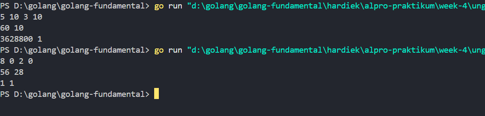
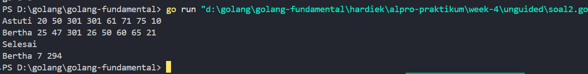
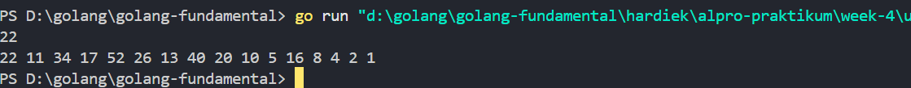

# <h1 align="center">Laporan Praktikum 04 <br> MODUL 4. PROCEDURE</h1>
<p align="center">HARDIEK TATENDRAA-103112430005</p>

## Dasar Teori

**Procedure** adalah subprogram atau blok kode dalam pemrograman yang dapat dieksekusi untuk menjalankan serangkaian instruksi tanpa mengembalikan nilai secara langsung. Berbeda dengan fungsi yang biasanya memiliki nilai kembalian

## Unguided

### Soal 1

Minggu ini, mahasiswa Fakultas Informatika mendapatkan tugas dari mata kuliah matematika diskrit untuk mempelajari kombinasi dan permutasi. Jonas salah seorang mahasiswa, iseng untuk mengimplementasikannya ke dalam suatu program. Oleh karena itu bersediakah kalian membantu Jonas? (tidak tentunya ya :p) Masukan terdiri dari empat buah bilangan asli 𝑎, 𝑏, 𝑐, dan 𝑑 yang dipisahkan oleh spasi, dengan syarat 𝑎 ≥ 𝑐 dan 𝑏 ≥ 𝑑. Keluaran terdiri dari dua baris. Baris pertama adalah hasil permutasi dan kombinasi 𝒂 terhadap 𝑐, sedangkan baris kedua adalah hasil permutasi dan kombinasi 𝑏 terhadap 𝑑. Catatan: permutasi (P) dan kombinasi (C) dari 𝑛 terhadap 𝑟 (𝑛 ≥ 𝑟) dapat dihitung dengan menggunakan persamaan berikut!

```go
package main

  

import "fmt"

  

func cariFaktorial(n int, hasil *int) {

    *hasil = 1

    for i := 2; i <= n; i++ {

        *hasil *= i

    }

}

  

func hitungPermutasiKombinasi(n, r int, permutasi *int, kombinasi *int) {

    if n < r {

        *permutasi, *kombinasi = 0, 0

        return

    }

  

    var fakt_n, fakt_r, fakt_nr int

    cariFaktorial(n, &fakt_n)

    cariFaktorial(r, &fakt_r)

    cariFaktorial(n-r, &fakt_nr)

  

    *permutasi = fakt_n / fakt_nr

    *kombinasi = fakt_n / (fakt_r * fakt_nr)

}

  

func main() {

    var (

        a, b, c, d                                     int

        permutasi1, permutasi2, kombinasi1, kombinasi2 int

    )

  

    fmt.Scan(&a, &b, &c, &d)

  

    hitungPermutasiKombinasi(a, c, &permutasi1, &kombinasi1)

    hitungPermutasiKombinasi(b, d, &permutasi2, &kombinasi2)

  

    fmt.Println(permutasi1, kombinasi1)

    fmt.Println(permutasi2, kombinasi2)

  

}
```

> Output
> 


Program di atas bertujuan untuk menghitung permutasi dan kombinasi berdasarkan inputan dari pengguna.

Pertama, kita memiliki procedure cariFaktorial yang bertugas menghitung faktorial dari suatu bilangan. Procedure ini memiliki parameter n sebagai input dan hasil sebagai pointer untuk menyimpan hasil faktorialnya. Nilai awal hasil diatur menjadi 1, lalu dilakukan perulangan dari 2 hingga `n`, di mana setiap iterasi akan mengalikan hasil dengan i, sehingga menghasilkan faktorial dari `n`.Selanjutnya, ada procedure hitungPermutasiKombinasi yang bertanggung jawab untuk menghitung permutasi dan kombinasi. Procedure ini memiliki parameter n dan r yang bertipe integer, serta pointer permutasi dan kombinasi yang digunakan untuk menyimpan hasil perhitungan. Pertama-tama, dilakukan pengecekan apakah n < r, karena jika benar, maka permutasi dan kombinasi tidak dapat dihitung dan langsung diberi nilai 0. Jika tidak, maka akan dipanggil procedure cariFaktorial untuk menghitung faktorial dari `n`, `r`, dan `(n - r)`. Setelah mendapatkan nilai faktorialnya, permutasi dihitung dengan rumus: P(n, r) = n! / (n - r)! dan kombinasi dihitung dengan rumus: C(n, r) = n! / (r! × (n - r)!) Hasil dari perhitungan ini kemudian disimpan dalam pointer `permutasi` dan `kombinasi`.Terakhir, dalam fungsi utama (main), kita memiliki beberapa variabel `a, b, c, d` bertipe integer untuk menampung input dari pengguna. Kemudian, ada variabel permutasi1, permutasi2, kombinasi1, kombinasi2 yang akan menyimpan hasil dari perhitungan permutasi dan kombinasi untuk dua set nilai yang berbeda. Setelah pengguna memasukkan empat angka, kita memanggil procedure hitungPermutasiKombinasi dua kali, pertama dengan nilai `a` dan `c`, lalu dengan `b` dan `d`. Hasil akhirnya akan ditampilkan menggunakan fmt.Println, di mana baris pertama akan menampilkan hasil permutasi dan kombinasi dari set pertama (`a, c`), dan baris kedua akan menampilkan hasil dari set kedua (`b, d`).

### Soal 2

Kompetisi pemrograman tingkat nasional berlangsung ketat. Setiap peserta diberikan 8 soal yang harus dapat diselesaikan dalam waktu 5 jam saja. Peserta yang berhasil menyelesaikan soal paling banyak dalam waktu paling singkat adalah pemenangnya. Buat program gema yang mencari pemenang dari daftar peserta yang diberikan. Program harus dibuat modular, yaitu dengan membuat prosedur hitungSkor yang mengembalikan total soal dan total skor yang dikerjakan oleh seorang peserta, melalui parameter formal. Pembacaan nama peserta dilakukan di program utama, sedangkan waktu pengerjaan dibaca di dalam prosedur. prosedure hitungSkor(in/out soal, skor : integer) Setiap baris masukan dimulai dengan satu string nama peserta tersebut diikuti dengan adalah 8 integer yang menyatakan berapa lama (dalam menit) peserta tersebut menyelesaikan soal. Jika tidak berhasil atau tidak mengirimkan jawaban maka otomatis dianggap menyelesaikan dalam waktu 5 jam 1 menit (301 menit). Satu baris keluaran berisi nama pemenang, jumlah soal yang diselesaikan, dan nilai yang diperoleh. Nilai adalah total waktu yang dibutuhkan untuk menyelesaikan soal yang berhasil diselesaikan.


```go
package main

  

import (

    "fmt"

)

  

func hitungSkor(w1, w2, w3, w4, w5, w6, w7, w8 int) (int, int, int) {

    soal := 0

    skor := 0

    totalWaktu := 0

  

    if w1 <= 300 {

        soal++

        skor += (300 - w1)

        totalWaktu += w1

    }

    if w2 <= 300 {

        soal++

        skor += (300 - w2)

        totalWaktu += w2

    }

    if w3 <= 300 {

        soal++

        skor += (300 - w3)

        totalWaktu += w3

    }

    if w4 <= 300 {

        soal++

        skor += (300 - w4)

        totalWaktu += w4

    }

    if w5 <= 300 {

        soal++

        skor += (300 - w5)

        totalWaktu += w5

    }

    if w6 <= 300 {

        soal++

        skor += (300 - w6)

        totalWaktu += w6

    }

    if w7 <= 300 {

        soal++

        skor += (300 - w7)

        totalWaktu += w7

    }

    if w8 <= 300 {

        soal++

        skor += (300 - w8)

        totalWaktu += w8

    }

  

    return soal, skor, totalWaktu

}

  

func main() {

    var nama, pemenang string

    var soal, skor, totalWaktu int

    var maxSoal, maxSkor, minWaktu int

    var w1, w2, w3, w4, w5, w6, w7, w8 int

  

    maxSoal, maxSkor, minWaktu = 0, 0, 999999

  

    for {

        fmt.Scan(&nama)

        if nama == "Selesai" {

            break

        }

  

        fmt.Scan(&w1, &w2, &w3, &w4, &w5, &w6, &w7, &w8)

  

        soal, skor, totalWaktu = hitungSkor(w1, w2, w3, w4, w5, w6, w7, w8)

  

        if (soal > maxSoal) ||

            (soal == maxSoal && skor > maxSkor) ||

            (soal == maxSoal && skor == maxSkor && totalWaktu < minWaktu) {

            pemenang = nama

            maxSoal = soal

            maxSkor = skor

            minWaktu = totalWaktu

        }

    }

    fmt.Println(pemenang, maxSoal, minWaktu)

}
```

> Output
> 

Penjelasan code di atas, pertama kita memiliki function hitungSkor yang memiliki 8 parameter dengan tipe data integer, yang digunakan untuk menghitung jumlah soal yang berhasil diselesaikan, skor yang diperoleh, dan total waktu yang dihabiskan oleh peserta.
Masuk ke dalam function hitungSkor, kita mendeklarasikan tiga variabel yaitu soal, skor, dan totalWaktu dengan nilai awal 0. Selanjutnya, kita melakukan pengecekan untuk setiap soal dengan kondisi jika waktu ≤ 300, maka soal dianggap dikerjakan. Jika memenuhi kondisi, maka variabel soal bertambah 1 (menandakan soal dikerjakan), variabel skor bertambah sesuai dengan rumus 300 - waktu pengerjaan, dan variabel totalWaktu ditambahkan dengan waktu pengerjaan soal tersebut. Pengecekan ini dilakukan sebanyak 8 kali untuk masing-masing soal. Jika soal memiliki waktu lebih dari 300 menit, maka soal tersebut dianggap tidak dikerjakan. Setelah semua soal dicek, function ini akan mengembalikan nilai soal, skor, dan total waktu ke pemanggilnya.
Masuk ke fungsi utama (main), kita memiliki beberapa variabel, yaitu nama dan pemenang sebagai string untuk menyimpan nama peserta dan pemenang. Soal, skor, totalWaktu digunakan untuk menyimpan hasil penghitungan dari function hitungSkor. Variabel maxSoal, maxSkor, dan minWaktu digunakan untuk membandingkan hasil peserta satu dengan lainnya, dengan nilai awal 0, 0, dan 999999 agar bisa dibandingkan. Selain itu, ada 8 variabel integer w1, w2, w3, w4, w5, w6, w7, w8 yang digunakan untuk menyimpan waktu pengerjaan masing-masing soal.
Lanjut ke dalam perulangan for, di mana program akan terus meminta input nama peserta hingga user memasukkan kata "Selesai". Jika nama yang diinput adalah "Selesai", maka perulangan berhenti. Jika tidak, program akan meminta input 8 angka yang merepresentasikan waktu pengerjaan masing-masing soal.Selanjutnya, program memanggil function hitungSkor dengan memasukkan 8 waktu pengerjaan soal sebagai parameter, lalu menyimpan hasilnya ke dalam soal, skor, dan totalWaktu. Setelah mendapatkan hasil dari function hitungSkor, program akan menentukan pemenang dengan kondisi berikut. Jika jumlah soal yang dikerjakan peserta lebih banyak dari peserta sebelumnya, maka peserta tersebut menjadi pemenang sementara. Jika jumlah soal sama, maka peserta dengan skor lebih tinggi yang akan menjadi pemenang. Jika jumlah soal dan skor sama, maka peserta dengan total waktu pengerjaan lebih sedikit yang akan menjadi pemenang.Terakhir, setelah seluruh peserta selesai diinput, program akan menampilkan nama pemenang, jumlah soal yang berhasil dikerjakan, dan total waktu pengerjaan soal tersebut.

### Soal 3

Skiena dan Revilla dalam Programming Challenges mendefinisikan sebuah deret bilangan. Deret dimulai dengan sebuah bilangan bulat n. Jika bilangan n saat itu genap, maka suku berikutnya adalah ½n, tetapi jika ganjil maka suku berikutnya bernilai 3n+1. Rumus yang sama digunakan terus menerus untuk mencari suku berikutnya. Deret berakhir ketika suku terakhir Halaman 9 | M o d u l P r a k t i k u m A l g o r i t m a P e m r o g r a m a n bernilai 1. Sebagai contoh jika dimulai dengan n=22, maka deret bilangan yang diperoleh adalah: 22 11 34 17 52 26 13 40 20 10 5 16 8 4 2 1 Untuk suku awal sampai dengan 1000000, diketahui deret selalu mencapai suku dengan nilai 1. Buat program skiena yang akan mencetak setiap suku dari deret yang dijelaskan di atas untuk nilai suku awal yang diberikan. Pencetakan deret harus dibuat dalam prosedur cetakDeret yang mempunyai 1 parameter formal, yaitu nilai dari suku awal. prosedure cetakDeret(in n : integer ) Masukan berupa satu bilangan integer positif yang lebih kecil dari 1000000. Keluaran terdiri dari satu baris saja. Setiap suku dari deret tersebut dicetak dalam baris yang dan dipisahkan oleh sebuah spasi.

```go
package main
  

import "fmt"

func cetakDeret(n int) {

    for n > 1 {

        fmt.Print(n, " ")

        if n%2 == 0 {

            n /= 2

        } else {

            n = 3*n + 1

        }

    }

    fmt.Println(n)

}

  

func main() {

    var n int

    fmt.Scan(&n)

  

    cetakDeret(n)

}
```

> Output
> 

Pertama, kita memiliki procedure cetakDeret(n int) yang digunakan untuk mencetak deret sesuai aturan yang diberikan. Procedure ini menerima satu parameter formal, yaitu n dengan tipe data integer. Masuk ke dalam procedure, kita menggunakan perulangan while dengan kondisi n > 1. Di dalam perulangan ini, kita mencetak nilai n diikuti dengan spasi. Setelah itu, kita mengecek apakah nilai n genap atau ganjil. Jika n genap, maka n dibagi 2 (n /= 2). Jika n ganjil, maka n dihitung dengan rumus 3n + 1. Perulangan ini akan terus berjalan hingga nilai n menjadi 1. Setelah keluar dari loop, angka 1 dicetak sebagai angka terakhir. Masuk ke fungsi main(), kita mendeklarasikan variabel n dengan tipe data integer yang digunakan untuk menyimpan input dari pengguna. Setelah itu, program membaca input menggunakan fmt.Scan(&n). Kemudian, kita memanggil procedure cetakDeret(n) untuk mencetak hasil


