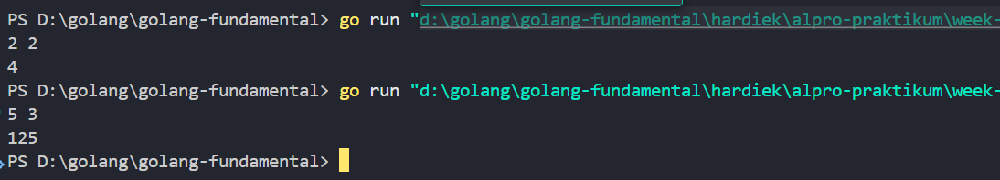

# <h1 align="center">Laporan Praktikum 05 <br> MODUL 5. Rekrusif</h1>
<p align="center">HARDIEK TATENDRAA-103112430005</p>

## Dasar Teori

Rekursif adalah teknik dalam pemrograman di mana sebuah fungsi memanggil dirinya sendiri untuk menyelesaikan suatu masalah. Rekrusif digunakan untuk memecah masalah dapat dipecah menjadi sub masalaha kecil, setiap program menjalan kan rekrusif  fungsi rekrusif akan terus berjalan sampai tak hingga, maka base case disini digunakan untuk kondisi berhenti rekrusif teersebut

## Unguided

### Soal 1

Deret fibonacci adalah sebuah deret dengan nilai suku ke-0 dan ke-1 adalah 0 dan 1, dan nilai suku ke-n selanjutnya adalah hasil penjumlahan dua suku sebelumnya. Secara umum dapat diformulasikan 𝑆𝑛 = 𝑆𝑛−1 + 𝑆𝑛−2 . Berikut ini adalah contoh nilai deret fibonacci hingga suku ke-10. Buatlah program yang mengimplementasikan fungsi rekursif pada deret fibonacci tersebut.

```go
package main

import "fmt"
  
func fibonaci(n int) int {

    if n <= 1 {

        return n

    }

    return fibonaci(n-1) + fibonaci(n-2)

}


func main() {

    var n int
    fmt.Print("Masukkan nilai n: ")
    fmt.Scan(&n)
    fmt.Printf("Bilangan fibonaci ke-%d adalah %d\n", n, fibonaci(n))

}
```

> Output
>  

Program di atas  adalah program untuk mencari deret fibonachi, pertama kita mulai dari funch main yang dimana disitu kita deklerasikan variable n sebagai integer, kemudian meminta input user dan di print untuk menampilkan output fibonaci dengan memangil fibonaci yang dimana parameter disitu n , masuk ke function fibonaci yang dimana memiliki parameter n integer dan  mengembalikan nilai integer, masuk ke if yang dimana program melakukan pengecekan  misal n = 0 maka fungsi mengembalikan 0 dan misal n = 1 maka mengembalikan 1 nah ini merupakan base case nya. Lanjut ke return kita panggil fungsi fibonaci nya sendiri (rekrusif) kan tadi jika n = 1 maka mengembalikan 0 jika kondisi tersebut tidak terpenuhi misalkan n >= 2 maka program akan masuk ke dua fibonachi ( fibonaci(n-1) dan fibonaci(n-2)) kemudian di jumlahkan 

### Soal 2
Buatlah sebuah program yang digunakan untuk menampilkan pola bintang berikut ini dengan menggunakan fungsi rekursif. N adalah masukan dari user


```go
package main
import "fmt"

  
func Bintang(baris int, current int) {

    if current > baris {

        return

    }

    for i := 0; i < current; i++ {

        fmt.Print("*")

    }

    fmt.Println()
    Bintang(baris, current+1)

}


func main() {

    var baris int

    fmt.Scan(&baris)

    Bintang(baris, 1)

  

}
```

> Output
> 

Program ini duganakn untuk membentuk pola bintang  pertama kita punya function main dimana ada deklerasi baris dengan tipe data integer , kemudian input user baris dan dilanjutkan pemangilan fungsi yg dimana baris dan 1 nah 1 ini current = 1 yang berarti pola bintang pertama saat di cetak adalah satu. Fungsi Bintang dengan parameter baris dan current  dilanjutkan base case dimana jika current >= baris maka program berhenti mirip dengan perulangan yg dimana jika i <= n program akan looping jika i >= n program berhenti for loop ini digunakan untu mencetak bintang, nah rekrusif disini Bintang(baris, current+1) artinya kan tadi di main kita tetapkan current itu 1 kan nah dan rekrusif Bintang(baris, current+1) maks 1 + 1 = 2 bintang untuk baris kedua current sekarang kan jadi 2  maka baris kedua current + 1 dimana current = 2 + 1 = 3 bintang dan seterusnya hinga mencapai base case nya

### Soal 3

Buatlah program yang mengimplementasikan rekursif untuk menampilkan faktor bilangan dari suatu N, atau bilangan yang apa saja yang habis membagi N. Masukan terdiri dari sebuah bilangan bulat positif N. Keluaran terdiri dari barisan bilangan yang menjadi faktor dari N (terurut dari 1 hingga N ya).

```go
package main

import "fmt"

func faktor(n int, i int) int {

    if i > n {

        return 0

    }
    if n%i == 0 {

        fmt.Print(i)

        fmt.Print(" ")

    }

    return faktor(n, i+1)

}
 

func main() {

    var n int

    fmt.Print("Masukkan nilai n: ")

    fmt.Scan(&n)

    faktor(n, 1)

}
```

> Output
> 

Program ini digunakan buat nyari faktor dari suatu bilangan pakai rekursi. Jadi, awalnya kita punya fungsi main, di mana kita deklarasiin variabel n sebagai integer. Nah, di sini user bakal masukin angka n, lalu program bakal panggil fungsi faktor(n, 1), yang artinya kita mulai ngecek faktor dari angka 1 dulu.Sekarang, masuk ke fungsi faktor(n, i). Ini fungsi rekursif yang bakal ngecek apakah i itu faktor dari n atau nggak. Di awal, ada base case, yaitu kalau i udah lebih besar dari n, fungsi langsung berhenti (karena nggak ada angka lebih besar dari n yang bisa jadi faktornya).
Selanjutnya, ada kondisi buat ngecek apakah n bisa dibagi i tanpa sisa (n % i == 0). Kalau iya, berarti i adalah faktor dari n, jadi langsung di print.
Terus, di bagian akhir ada pemanggilan rekursif faktor(n, i+1), yang artinya kita naik ke angka berikutnya buat dicek lagi.

### Soal 4

Buatlah program yang mengimplementasikan rekursif untuk menampilkan barisan bilangan tertentu. Masukan terdiri dari sebuah bilangan bulat positif N. Keluaran terdiri dari barisan bilangan dari N hingga 1 dan kembali ke N.

```go
package main

  

import "fmt"

  

func Turun(n int, i int) {

    if i < 1 {

        return

    }

    fmt.Print(i)

    fmt.Print(" ")

    Turun(n, i-1)

}

  

func Naik(n int, i int) {

    if i > n {

        return

    }

    fmt.Print(i)

    fmt.Print(" ")

    Naik(n, i+1)

}

  

func main() {

    var n int

  

    fmt.Scan(&n)

    Turun(n, n)

    Naik(n, 2)

}
```

> Output
> 

Program diatas digunakan untuk looping ke n , pertama kita punya dua fungsi pertama fungsi turun yang dimana  memiliki parameter i dan n dengan tipe data integer, lanjut ke base case jik i kurang dari satu maka program berhenti biar tidak infiniti misal kan fungsi kita masukan n = 5 karena rekrusif nya itu(n, i-1) artinya bakal ngurang terus misalkan tidak ada base case i > n  maka bakal ngurang misal kan 5 nih n nya maka bakal ngurang terus 5 4 3 2 1 0 -1.... infiniti makanya perlu kasih base case i < n berhenti, lanjut ke fungsi naik memiliki parameter sama namun disini base case nya kita beri batasan naik agar tidak melebihi batas karena rekrusif nya disini i + 1 bakal infiniti karena tidak ada kondisi yg membuat dia berhenti misal kita  isi n 5 karena  kita panggil naik(n, 2) dimana i itu 2 maka  2 3 4 5 nah ini bakal berhenti karena base case tadi

### Soal 5

Buatlah program yang mengimplementasikan rekursif untuk menampilkan barisan bilangan ganjil. Masukan terdiri dari sebuah bilangan bulat positif N. Keluaran terdiri dari barisan bilangan ganjil dari 1 hingga N.

```go
package main

import "fmt"

func Ganjil(n int, i int) {

    if i > n {

        return

    }

    if i%2 == 1 {

        fmt.Print(i)

        fmt.Print(" ")

    }

    Ganjil(n, i+1)

}

  

func main() {

    var n int


    fmt.Scan(&n)

    Ganjil(n, 1)

}
```

> Output
> 

program diatas digunakan untuk mecari bilangan apakah ganjil pertama kita punya fungsi ganjil dengan parameter n dan i. Lanjut ke base case, kita ber kondisi i > n, maka program berhenti. Karena jika kita input n = 5 dan i kita mulai dari 1, program bakal bertambah. Nah, saat i = 5, program berhenti, karena jika i = 6, itu sudah lebih dari inputan user.Lanjut ke if kedua, kita cek kondisi perulangan hanya akan mencetak apabila kondisi terpenuhi, yang di mana i mod 2 == 1 merupakan ciri bilangan ganjil. Lanjut ke rekursif, di sini Ganjil(n, i+1), i bakal terus bertambah hingga base case.Misal kita input n = 5.  Pertama, program karena di main, kita inisialisasi i = 1, berarti akan dimulai dari 1. Program bakal cek apakah 1 lebih besar dari n. Jika tidak, maka if ganjil terpenuhi, lanjut ke 2, apakah 2 habis dibagi 2? Karena false, maka if-nya tidak terpenuhi, maka akan lanjut ke 3, karena 3 ganjil, maka lanjut ke 4, karena 4 genap, maka lompat, tidak mencetak 4.
Lanjut 5, apakah 5 lebih besar dari n? Tidak, maka lanjut cek apakah 5 habis dibagi 2. True, maka print bilangan tersebut. Lanjut ke 6, apakah 6 lebih besar dari n? Karena true, maka program berhenti

### Soal 6

Buatlah program yang mengimplementasikan rekursif untuk mencari hasil pangkat dari dua buah bilangan. Masukan terdiri dari bilangan bulat x dan y. Keluaran terdiri dari hasil x dipangkatkan y. Catatan: diperbolehkan menggunakan asterik "*", tapi dilarang menggunakan import "math

```go
package main

  

import "fmt"

  

func pangkat(x, y int) int {

    if y == 0 {

        return 1

    }

    return x * pangkat(x, y-1)

}

  

func main() {

    var x, y int

    fmt.Scan(&x, &y)

    println(pangkat(x, y))

}
```

> Output
> 

Program ini digunakan untuk menghitung hasil perpangkatan dari dua bilangan, yaitu x pangkat y, menggunakan rekursi. Fungsi hitung(x, y) memiliki base case yang mengecek apakah nilai y sudah mencapai 0. Jika y == 0, maka akan mengembalikan nilai 1, karena dalam aturan matematika, berapa pun bilangan yang dipangkatkan 0 hasilnya selalu 1. Jika y belum 0, program akan menjalankan proses rekursif dengan mengalikan x dengan hasil pemanggilan fungsi hitung(x, y-1). Artinya, program akan terus mengalikan x dengan dirinya sendiri sambil mengurangi nilai y satu per satu sampai y mencapai 0.Di dalam fungsi main, program meminta input dari user untuk nilai x dan y, lalu memanggil fungsi hitung(x, y) dan mencetak hasilnya. Misalnya, jika user memasukkan x = 2 dan y = 3, maka program akan menjalankan hitung(2,3), yang akan memanggil hitung(2,2), lalu hitung(2,1), hingga akhirnya hitung(2,0) yang mengembalikan 1 sebagai base case. Setelah mencapai base case, hasilnya dihitung mundur, yaitu 2 * 1 = 2, lalu 2 * 2 = 4, dan terakhir 2 * 4 = 8. Sehingga output akhirnya adalah 8.


