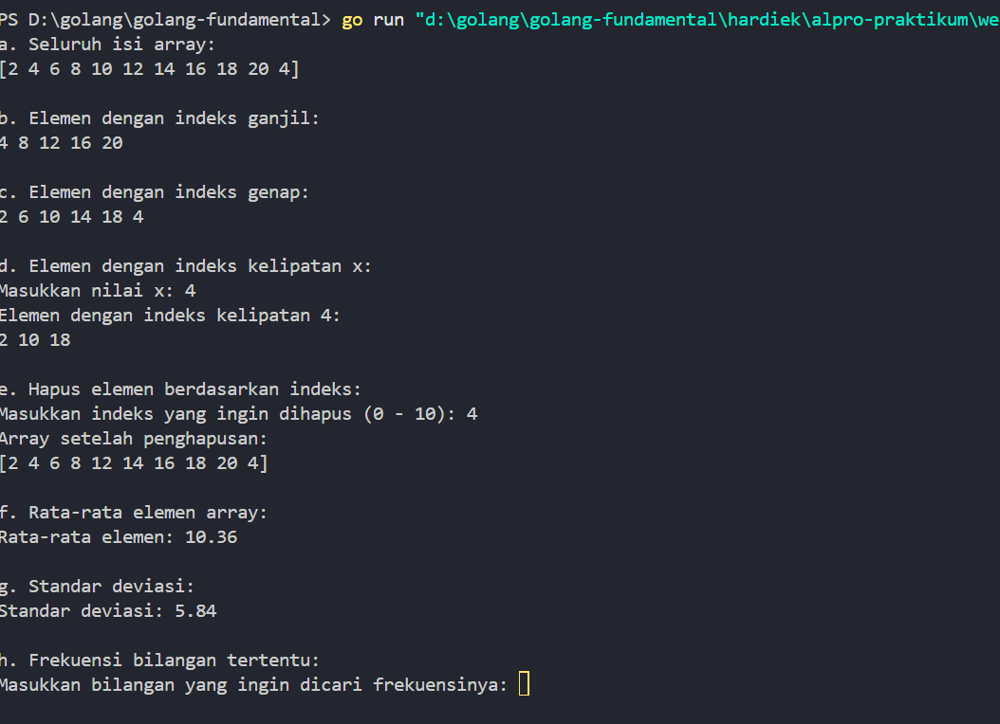
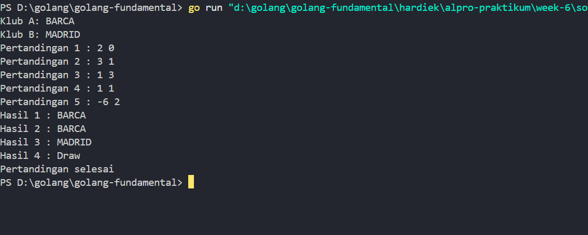
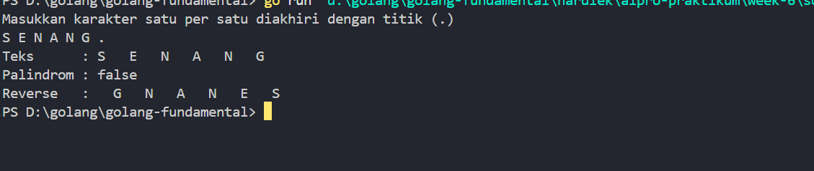

# <h1 align="center">Laporan Praktikum 07 <br> MODUL 7. Array </h1>
<p align="center">HARDIEK TATENDRAA-103112430005</p>

## Dasar Teori

array adalah struktur data yang digunakan untuk menyimpan sekumpulan data dengan tipe yang sama dalam satu tempat. Elemen dalam array disimpan secara berurutan dan bisa diakses menggunakan indeks, yang biasanya dimulai dari 0. Array sangat berguna untuk menyimpan data dalam jumlah banyak, apalagi kalau kita butuh mengaksesnya secara langsung dan cepat.

## Unguided

### Soal 1

) Suatu lingkaran didefinisikan dengan koordinat titik pusat (𝑐𝑥, 𝑐𝑦) dengan radius 𝑟. Apabila diberikan dua buah lingkaran, maka tentukan posisi sebuah titik sembarang (𝑥, 𝑦) berdasarkan dua lingkaran tersebut. Gunakan tipe bentukan titik untuk menyimpan koordinat, dan tipe bentukan lingkaran untuk menyimpan titik pusat lingkaran dan radiusnya. Masukan terdiri dari beberapa tiga baris. Baris pertama dan kedua adalah koordinat titik pusat dan radius dari lingkaran 1 dan lingkaran 2, sedangkan baris ketiga adalah koordinat titik sembarang. Asumsi sumbu x dan y dari semua titik dan juga radius direpresentasikan dengan bilangan bulat. Keluaran berupa string yang menyatakan posisi titik "Titik di dalam lingkaran 1 dan 2", "Titik di dalam lingkaran 1", "Titik di dalam lingkaran 2", atau "Titik di luar lingkaran 1 dan 2".

```go
package main

  

import (

    "fmt"

)

  

type Point struct {

    x, y int

}

  

type lingkaran struct {

    center Point

    radius int

}

  

func isInside(p Point, c lingkaran) bool {

    dx := float64(p.x - c.center.x)

    dy := float64(p.y - c.center.y)

    distanceSquared := dx*dx + dy*dy

    return distanceSquared <= float64(c.radius*c.radius)

}

  

func main() {

    var x1, y1, r1 int

    var x2, y2, r2 int

    var xt, yt int

  

    fmt.Scan(&x1, &y1, &r1)

    fmt.Scan(&x2, &y2, &r2)

    fmt.Scan(&xt, &yt)

  

    lingkaran1 := lingkaran{Point{x1, y1}, r1}

    lingkaran2 := lingkaran{Point{x2, y2}, r2}

    point := Point{xt, yt}

  

    in1 := isInside(point, lingkaran1)

    in2 := isInside(point, lingkaran2)

  

    if in1 && in2 {

        fmt.Println("Titik di dalam lingkaran 1 dan 2")

    } else if in1 {

        fmt.Println("Titik di dalam lingkaran 1")

    } else if in2 {

        fmt.Println("Titik di dalam lingkaran 2")

    } else {

        fmt.Println("Titik di luar lingkaran 1 dan 2")

    }

}
```

> Output
> 

Program di atas digunakan untuk mengecek apakah sebuah titik berada di dalam dua lingkaran atau tidak. Pertama, program mendefinisikan dua buah struktur data yaitu Point yang merepresentasikan koordinat x dan y dari suatu titik, serta lingkaran yang memiliki titik pusat (center) dan jari-jari (radius). Lalu, ada fungsi isInside yang digunakan untuk menentukan apakah suatu titik berada di dalam sebuah lingkaran. Caranya dengan menghitung jarak antara titik tersebut dengan pusat lingkaran menggunakan rumus jarak kuadrat, yaitu (x2 - x1)² + (y2 - y1)², lalu dibandingkan dengan kuadrat dari radius lingkaran. Jika jarak kuadrat ini lebih kecil atau sama dengan kuadrat radius, maka titik dianggap berada di dalam lingkaran.Kemudian di dalam fungsi main, program meminta masukan dari pengguna untuk koordinat dan jari-jari dari dua buah lingkaran, serta satu titik yang akan dicek. Setelah itu, dibuat dua buah lingkaran dan satu titik berdasarkan input tersebut. Program lalu mengecek apakah titik berada di dalam masing-masing lingkaran dengan memanggil fungsi isInside. Hasil dari pengecekan tersebut akan menentukan output dari program, apakah titik tersebut berada di dalam kedua lingkaran, hanya di salah satu lingkaran, atau di luar keduanya. Program ini berguna untuk mengevaluasi posisi titik terhadap dua buah lingkaran dalam bidang dua dimensi.

### Soal 2
Sebuah array digunakan untuk menampung sekumpulan bilangan bulat. Buatlah program yang digunakan untuk mengisi array tersebut sebanyak N elemen nilai. Asumsikan array memiliki kapasitas penyimpanan data sejumlah elemen tertentu. Program dapat menampilkan beberapa informasi berikut: a. Menampilkan keseluruhan isi dari array. b. Menampilkan elemen-elemen array dengan indeks ganjil saja. c. Menampilkan elemen-elemen array dengan indeks genap saja (asumsi indek ke-0 adalah genap). d. Menampilkan elemen-elemen array dengan indeks kelipatan bilangan x. x bisa diperoleh dari masukan pengguna. e. Menghapus elemen array pada indeks tertentu, asumsi indeks yang hapus selalu valid. Tampilkan keseluruhan isi dari arraynya, pastikan data yang dihapus tidak tampil f. Menampilkan rata-rata dari bilangan yang ada di dalam array. g. Menampilkan standar deviasi atau simpangan baku dari bilangan yang ada di dalam array tersebut. h. Menampilkan frekuensi dari suatu bilangan tertentu di dalam array yang telah diisi tersebut.

```go
package main

  

import (

    "fmt"

    "math"

)

  

func main() {

    var bilangan = [11]int{2, 4, 6, 8, 10, 12, 14, 16, 18, 20, 4}

  

    // a. Menampilkan keseluruhan isi array

    fmt.Println("a. Seluruh isi array:")

    fmt.Println(bilangan)

  

    // b. Menampilkan elemen dengan indeks ganjil

    fmt.Println("\nb. Elemen dengan indeks ganjil:")

    for i := 1; i < len(bilangan); i += 2 {

        fmt.Print(bilangan[i], " ")

    }

    fmt.Println()

  

    // c. Menampilkan elemen dengan indeks genap

    fmt.Println("\nc. Elemen dengan indeks genap:")

    for i := 0; i < len(bilangan); i += 2 {

        fmt.Print(bilangan[i], " ")

    }

    fmt.Println()

  

    // d. Menampilkan elemen dengan indeks kelipatan x

    fmt.Println("\nd. Elemen dengan indeks kelipatan x:")

    var x int

    fmt.Print("Masukkan nilai x: ")

    fmt.Scan(&x)

  

    fmt.Printf("Elemen dengan indeks kelipatan %d:\n", x)

    for i := 0; i < len(bilangan); i++ {

        if i%x == 0 {

            fmt.Print(bilangan[i], " ")

        }

    }

    fmt.Println()

  

    // e. Menghapus elemen pada indeks tertentu

    fmt.Println("\ne. Hapus elemen berdasarkan indeks:")

    var hapus int

    fmt.Printf("Masukkan indeks yang ingin dihapus (0 - %d): ", len(bilangan)-1)

    fmt.Scan(&hapus)

  

    if hapus >= 0 && hapus < len(bilangan) {

        var newBilangan []int

        for i, val := range bilangan {

            if i != hapus {

                newBilangan = append(newBilangan, val)

            }

        }

        fmt.Println("Array setelah penghapusan:")

        fmt.Println(newBilangan)

    } else {

        fmt.Println("Indeks tidak valid!")

    }

  

    // f. Menampilkan rata-rata

    fmt.Println("\nf. Rata-rata elemen array:")

    var total int

    for _, val := range bilangan {

        total += val

    }

    rata := float64(total) / float64(len(bilangan))

    fmt.Printf("Rata-rata elemen: %.2f\n", rata)

  

    // g. Standar deviasi

    fmt.Println("\ng. Standar deviasi:")

    var sum float64

    for _, val := range bilangan {

        sum += math.Pow(float64(val)-rata, 2)

    }

    sd := math.Sqrt(sum / float64(len(bilangan)))

    fmt.Printf("Standar deviasi: %.2f\n", sd)

  

    // h. Frekuensi bilangan tertentu

    fmt.Println("\nh. Frekuensi bilangan tertentu:")

    var cari int

    fmt.Print("Masukkan bilangan yang ingin dicari frekuensinya: ")

    fmt.Scan(&cari)

  

    frek := 0

    for _, val := range bilangan {

        if val == cari {

            frek++

        }

    }

    fmt.Printf("Frekuensi %d adalah %d kali\n", cari, frek)

}
```

> Output
> 

Penjelasan program diatas yang pertama  kita deklerasikan array  dengan total index 11 tipe data string, selanjutnya masuk ke soal 1 dimana saya punya program untuk menampilkan array nya dengan cara cukup kita panggil variable nya di print, lanjut ke b dimana  gunakan perulangan kita definisikan i dimulai dari 1 kenapa 1? karena 1 adalah bilangan ganjil , dan i nanti (i + 2) jadi nanti jadinya 1 + 2 = 3, 3 + 2 =  5 dst nah ini bilangan ganjil, lanjut kita ke c dimana ini hampir sama namun i dimulai dari 0 karena dari printahnya 0 kita asumsikan genap.d kita gunakan untuk  melipatkan index dengan x atau inputan user  dimana i nanti mod dengan  x . e menghapus index  nah kalau di javascript dulu saya ada delete nya namun di go ini tidak ada jadi saya mengggunakan, pertama kita buat input untuk user ingin menghapus yang mana ,lanjut ke if, if melakukan pengecekan agar indeks yang dimasukkan valid, yaitu tidak kurang dari 0 tidak lebih atau sama dengan panjang array (karena indeks maksimum = len - 1) kalau  tidak valid masuk ke else, lanjut  ke forr nya Melakukan looping ke seluruh elemen array bilangan. Setiap elemen dicek: Jika indeks (`i`) bukan indeks yang ingin dihapus  tambahkan (append) ke new Bilangan
Jika sama dengan indeks yang ingin dihapus dilewati, artinya tidak ditambahkan. lanjut . f dimana kita diprintah untuk mencari rata rata untuk alur nya pertama kita dekelrasikan total, lanjut ada forr yang digunakan untuk melakukan looping ke semua elemen bilangan, val adalah nilai tiap elemen array , setiap elemen ditambahkan ke total misal {1,2,3}(total = 1 + 2 +3) yang terakhir total element kita bagi dengan toal index nya .g ini, program menghitung standar devias idari nilai-nilai yang ada di dalam array bilangan. Pertama-tama, program menggunakan nilai rata-rata (rata) yang telah dihitung sebelumnya. Kemudian, program memulai sebuah variabel sum bertipe float64 untuk menyimpan total kuadrat selisih setiap elemen dengan rata-rata. Proses iterasi dilakukan dengan perulangan for, di mana setiap nilai dalam array bilangan dikonversi ke tipe float64, dikurangkan dengan rata, lalu hasil selisihnya dikuadratkan menggunakan fungsi math.Pow. Nilai kuadrat ini kemudian ditambahkan ke dalam sum. Setelah semua nilai diproses, nilai  akar kuadrat dari varians dihitung menggunakan math.Sqrt, dan hasilnya disimpan dalam variabel sd sebagai nilai standar deviasi.h dari program digunakan untuk menghitung frekuensi kemunculan suatu bilangan tertentu di dalam array bilangan. Pertama-tama, program meminta pengguna untuk memasukkan angka yang ingin dicari jumlah kemunculannya, lalu menyimpannya dalam variabel cari. Setelah itu, sebuah variabel frek diinisialisasi dengan nilai 0, yang berfungsi sebagai penghitung. Program kemudian melakukan perulangan for untuk memeriksa setiap elemen dalam array bilangan. Jika elemen tersebut sama dengan nilai yang dicari (cari), maka nilai frek akan ditambah satu. Setelah seluruh elemen diperiksa, program mencetak hasil jumlah kemunculan angka tersebut di array menggunakan fmt.Printf
### Soal 3

Sebuah program digunakan untuk menyimpan dan menampilkan nama-nama klub yang memenangkan pertandingan bola pada suatu grup pertandingan. Buatlah program yang digunakan untuk merekap skor pertandingan bola 2 buah klub bola yang berlaga. Pertama-tama program meminta masukan nama-nama klub yang bertanding, kemudian program meminta masukan skor hasil pertandingan kedua klub tersebut. Yang disimpan dalam array adalah nama-nama klub yang menang saja. Proses input skor berhenti ketika skor salah satu atau kedua klub tidak valid (negatif). Di akhir program, tampilkan daftar klub yang memenangkan pertandingan.

```go
package main

  

import (

    "fmt"

)

  

func main() {

    var klubA, klubB string

    fmt.Print("Klub A: ")

    fmt.Scanln(&klubA)

    fmt.Print("Klub B: ")

    fmt.Scanln(&klubB)

  

    var skorA, skorB int

  

    var hasil []string

  

    pertandingan := 0

  

    for {

        fmt.Printf("Pertandingan %d : ", pertandingan)

        fmt.Scan(&skorA, &skorB)

  

        if skorA < 0 || skorB < 0 {

            break

        }

  

        if skorA > skorB {

            hasil = append(hasil, klubA)

        } else if skorA < skorB {

            hasil = append(hasil, klubB)

        } else {

            hasil = append(hasil, "Draw")

        }

  

        pertandingan++

    }

  

    for i, h := range hasil {

        fmt.Printf("Hasil %d : %s\n", i+1, h)

    }

  

    fmt.Println("Pertandingan selesai")

  

}
```

> Output
> 

Program diatas adala digunakan untuk menyimpan nama nama klub yang menang dan draw, kita masuk ke alur program pertama deklreasikan variable klubA dan klubB untuk inputan user atau nama club nya ,lanjut kita juga deklerasikan variable skor untuk menampung skor kedua klub, selanjutanya kita juga deklerasikann array kosong untuk menyimpan hasil ke dalam array dan kita juga butuh pertandingan untuk nanti count pertandingan 1 hingga n , lanjut kita ke repeat until dimana terdapat inputan score , kemudia kita punya logika if logikanya jika klubA memiliki skor lebih besar dari klubB  simpan / slice klubA ke array hasil  sebaliknya juga jika klubB lebih besar simpan, kalau sama sama besar akan menampilkan draw, dan pertandingan ++ setiap perulangan.lanjuta yang terakhir for nya digunakan untuk menampilkan hasil draw atau menang 

### Soal 4

Buatlah program yang mengimplementasikan rekursif untuk menampilkan barisan bilangan tertentu. Masukan terdiri dari sebuah bilangan bulat positif N. Keluaran terdiri dari barisan bilangan dari N hingga 1 dan kembali ke N.

```go
package main

  

import (

    "fmt"

)

  

const NMAX int = 127

  

type tabel [NMAX]rune

  

func isiArray(t *tabel, n *int) {

    var c rune

    fmt.Println("Masukkan karakter satu per satu diakhiri dengan titik (.)")

  

    for {

        fmt.Scanf("%c", &c)

        if c == '.' || *n >= NMAX {

            break

        }

        t[*n] = c

        *n++

    }

}

  

func cetakArray(t *tabel, n int) {

    for i := 0; i < n; i++ {

        fmt.Printf("%c ", t[i])

    }

    fmt.Println()

}

  

func balikkanArray(t *tabel, n int) {

    for i := 0; i < n/2; i++ {

        t[i], t[n-1-i] = t[n-1-i], t[i]

    }

}

  

func palindrom(t tabel, n int) bool {

    for i := 0; i < n/2; i++ {

        if t[i] != t[n-1-i] {

            return false

        }

    }

    return true

}

  

func main() {

    var tab tabel

    var n int

  

    isiArray(&tab, &n)

  

    fmt.Print("Teks      : ")

    cetakArray(&tab, n)

  

    if palindrom(tab, n) {

        fmt.Println("Palindrom : true")

    } else {

        fmt.Println("Palindrom : false")

    }

  

    balikkanArray(&tab, n)

    fmt.Print("Reverse   : ")

    cetakArray(&tab, n)

}
```

> Output
> 

Program ini sebenarnya digunakan buat ngecek apakah input karakter itu palindrom atau bukan, terus juga nampilin bentuk teks awal dan teks yang sudah dibalik. Jadi, alurnya kayak gini:
Pertama, kita deklarasi dulu konstanta NMAX yang artinya jumlah maksimum karakter yang bisa ditampung (di sini 127). Terus kita bikin tipe data tabel yang isinya array of `rune`, karena kita mau simpan karakter satu-satu.Di bagian fungsi isiArray, program minta user masukin karakter satu per satu dan diakhiri dengan titik (`.`). Karakter yang dimasukin bakal disimpan ke dalam array `tabel`. Setiap kali input karakter, variabel `n` yang ngitung jumlah karakter akan ditambah.
Setelah input selesai, program akan cetak isi array tadi lewat cetakArray, jadi kita bisa lihat karakter yang udah dimasukin user.Nah, sebelum array dibalik, program langsung ngecek dulu apakah teks itu palindrom atau bukan pakai fungsi palindrom. Logikanya, karakter pertama harus sama kayak terakhir, kedua sama kayak sebelum terakhir, dan seterusnya. Kalau semua cocok, hasilnya `true`, kalau nggak cocok ya `false`.Baru setelah itu, array dibalik pakai `balikkanArray` dan dicetak ulang biar kita bisa lihat bentuk teks setelah dibalik.

