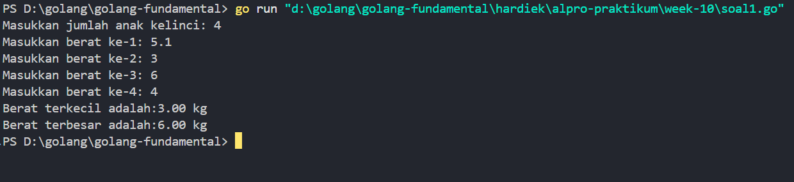
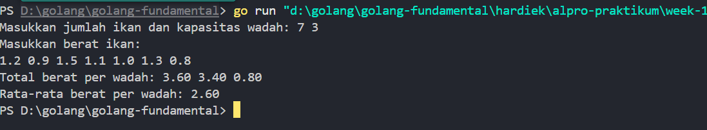
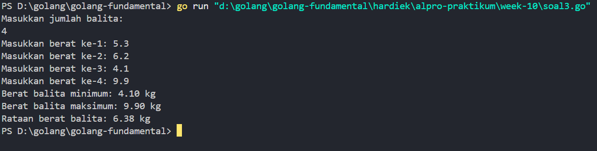

# <h1 align="center">Laporan Praktikum 10 <br> MODUL 10. NILAI EKSTRIM </h1>
<p align="center">HARDIEK TATENDRA-103112430005</p>

## Dasar Teori

Pencarian adalah suatu proses yang lazim dilakukan di dalam kehidupan sehari-hari. Contoh penggunaannya dalam kehidupan nyata sangat beragam, misalnya pencarian file di dalam directory komputer, pencarian suatu teks di dalam sebuah dokumen, pencarian buku pada rak buku, dan contoh lainnya. Pertama pada modul ini akan dipelajari salah satu algoritma pencarian nilai terkecil atau terbesar pada sekumpulan data, atau biasa disebut pencarian nilai ekstrim.

## Unguided

### Soal 1

Sebuah program digunakan untuk mendata berat anak kelinci yang akan dijual ke pasar. Program ini menggunakan array dengan kapasitas 1000 untuk menampung data berat anak kelinci yang akan dijual. Masukan terdiri dari sekumpulan bilangan, yang mana bilangan pertama adalah bilangan bulat N yang menyatakan banyaknya anak kelinci yang akan ditimbang beratnya. Selanjutnya N bilangan riil berikutnya adalah berat dari anak kelinci yang akan dijual. Keluaran terdiri dari dua buah bilangan riil yang menyatakan berat kelinci terkecil dan terbesar.

```go
package main

  

import "fmt"

  

const max_array = 1000

  

type beratKelinci [max_array]float64

  

func main() {

    var N int

    var MIN, MAX float64

  

    fmt.Print("Masukkan jumlah anak kelinci: ")

    fmt.Scan(&N)

  

    var berat beratKelinci

  

    for i := 0; i < N; i++ {

        fmt.Print("Masukkan berat ke-", i+1, ": ")

        fmt.Scan(&berat[i])

  

        if i == 0 {

            MIN = berat[i]

            MAX = berat[i]

        } else {

            if berat[i] < MIN {

                MIN = berat[i]

            }

            if berat[i] > MAX {

                MAX = berat[i]

            }

        }

    }

  

    fmt.Printf("Berat terkecil adalah:%.2f kg\n", MIN)

    fmt.Printf("Berat terbesar adalah:%.2f kg\n", MAX)

}
```

> Output
> 

Program di atas digunakan untuk mencari berat terkecil dan terbesar, untuk alogirtma nya sebagai beriikut. pertama saya punya constant yang menampung max elemen array yang dapat ditampung, lanjut tipe constant tadi kita gunakan di tipe bentukan array berat kelinci. Masuk ke prgoram utama kita deklerasikan N untuk jumlah kelinci nya dan variable MIN, MAX , kemudian perlu input N untuk jumlah anak kelinci nya, selaanjutnya saya punya variable berat dengan menggunakan tipe data bentukan tadi masuk ke for loop seperti biasa, masuk ke logika if apabila kondisi terpenuhi jika i == 0 artinya jumlah klinci 0 maka tidak adaa input user maka blok kode dijalankan max dan min 0, jika kondisi i == 0 tidak terpenuhi maka masuk ke else dengan dua kondisi jika element array berat < Min artinya berat array i adalah min ya dan sebaliknya jika berat array[i] lebih besar maka itu Max nya  

### Soal 2
Sebuah program digunakan untuk menentukan tarif ikan yang akan dijual ke pasar. Program ini menggunakan array dengan kapasitas 1000 untuk menampung data berat ikan yang akan dijual. Masukan terdiri dari dua baris, yang mana baris pertama terdiri dari dua bilangan bulat x dan y. Bilangan x menyatakan banyaknya ikan yang akan dijual, sedangkan y adalah banyaknya ikan yang akan dimasukan ke dalam wadah. Baris kedua terdiri dari sejumlah x bilangan riil yang menyatakan banyaknya ikan yang akan dijual. Keluaran terdiri dari dua baris. Baris pertama adalah kumpulan bilangan riil yang menyatakan total berat ikan di setiap wadah (jumlah wadah tergantung pada nilai x dan y, urutan ikan yang dimasukan ke dalam wadah sesuai urutan pada masukan baris ke-2). Baris kedua adalah sebuah bilangan riil yang menyatakan berat rata-rata ikan di setiap wadah

```go
package main

  

import "fmt"

  

const maxArray = 1000

  

func main() {

    var x, y int

    var beratIkan [maxArray]float64

    var totalWadah [maxArray]float64

  

    fmt.Print("Masukkan jumlah ikan dan kapasitas wadah: ")

    fmt.Scan(&x, &y)

  

    fmt.Println("Masukkan berat ikan:")

    for i := 0; i < x; i++ {

        fmt.Scan(&beratIkan[i])

    }

  

    jumlahWadah := x / y

    if x%y != 0 {

        jumlahWadah++

    }

  

    for i := 0; i < x; i++ {

        indexWadah := i / y

        totalWadah[indexWadah] += beratIkan[i]

    }

  

    fmt.Print("Total berat per wadah: ")

    for i := 0; i < jumlahWadah; i++ {

        fmt.Printf("%.2f ", totalWadah[i])

    }

    fmt.Println()

  

    var total float64

    for i := 0; i < jumlahWadah; i++ {

        total += totalWadah[i]

    }

    rata := total / float64(jumlahWadah)

  

    fmt.Printf("Rata-rata berat per wadah: %.2f\n", rata)

}
```

> Output
> 

Program di atas digunakan untuk menghitung total berat ikan di setiap wadah dan juga menghitung rata-rata berat antar wadah. Untuk algoritmanya, sebagai berikut:  
Pertama saya punya const maxArray untuk menentukan kapasitas maksimal array yang bisa digunakan, yaitu 1000 elemen. Lalu saya deklarasikan dua array, yaitu beratIkan untuk menampung semua data berat ikan yang akan dimasukkan, dan totalWadah untuk menampung total berat ikan di tiap wadah.Masuk ke bagian utama program `main`, saya deklarasikan dua buah variabel `x` dan `y`. x untuk menyatakan jumlah ikan yang akan dijual, dan `y` untuk kapasitas satu wadah (berapa ikan bisa masuk ke satu wadah). Kedua nilai ini kita input lewat fmt.Scan.Selanjutnya saya punya perintah for untuk input berat ikan sebanyak `x` kali. Nilai-nilai berat tersebut disimpan dalam array beratIka.Kemudian untuk menentukan berapa jumlah wadah yang dibutuhkan, saya gunakan pembagian x / y, tapi karena bisa saja jumlah ikan tidak habis dibagi kapasitas wadah, maka saya tambahkan pengecekan:  if x % y != 0, artinya jika ada sisa, maka wadah ditambah satu agar semua ikan tetap masuk.Lanjut ke proses pengisian wadah, saya looping lagi sebanyak jumlah ikan x, lalu saya hitung indeks wadah dari setiap ikan berdasarkan i / y, artinya setiap y ikan masuk ke wadah berikutnya. Total berat di masing-masing wadah dijumlahkan ke dalam array totalWadah.Setelah selesai, saya tampilkan semua total berat per wadah dengan fmt.Printf sebanyak jumlah wadah yang sudah dihitung.Terakhir, untuk menghitung rata-rata berat per wadah, saya jumlahkan semua isi dari totalWadah kemudian dibagi dengan jumlah wadah, hasilnya ditampilkan sebagai rata-rata.
### Soal 3

Pos Pelayanan Terpadu (posyandu) sebagai tempat pelayanan kesehatan perlu mencatat data berat balita (dalam kg). Petugas akan memasukkan data tersebut ke dalam array. Dari data yang diperoleh akan dicari berat balita terkecil, terbesar, dan reratanya.

```go
package main

  

import "fmt"

  

type arrBalita [100]float64

  

func hitungMax(arrBalita *arrBalita, bMin, bMax *float64, N int) {

    for i := 0; i < N; i++ {

        fmt.Print("Masukkan berat ke-", i+1, ": ")

        fmt.Scan(&(*arrBalita)[i])

        if i == 0 {

            *bMin = (*arrBalita)[i]

            *bMax = (*arrBalita)[i]

        } else {

            if (*arrBalita)[i] < *bMin {

                *bMin = (*arrBalita)[i]

            }

            if (*arrBalita)[i] > *bMax {

                *bMax = (*arrBalita)[i]

            }

        }

    }

    fmt.Printf("Berat balita minimum: %.2f kg\n", *bMin)

    fmt.Printf("Berat balita maksimum: %.2f kg\n", *bMax)

}

  

func rataan(arrBerat arrBalita, N int) float64 {

    if N == 0 {

        return 0

    }

    total := 0.0

    for i := 0; i < N; i++ {

        total += arrBerat[i]

    }

    return total / float64(N)

}

  

func main() {

    var arrBalita arrBalita

    var N int

    var MIN, Max float64

  

    fmt.Println("Masukkan jumlah balita:")

    fmt.Scan(&N)

  

    hitungMax(&arrBalita, &MIN, &Max, N)

    fmt.Printf("Rataan berat balita: %.2f kg\n", rataan(arrBalita, N))

}
```

> Output
> 

Program diatas adalah program untuk mencari berat bealita terkecil dan terbesar serta rataan, pertama  kita punya procedure hitungMax dengan parameter arrBalita dengan tipe bentukan arrBalita lalu kita pointer kan , lanjut ke parameter bMin,Bmax  tipe data float64, kemudian N untuk jumlah balita, masuk ke forloop ini mirp seperti no1 satu logic nya jika i == 0 maka max dan min nya 0, jika kondisi i == 0 tidak terpenuhi masuk ke blok kode else dengan if jika arraBalita[i] lebih kecil dari bMin maka itu adalah nilai min nya dan sebaliknya jika arrBalita[i] lebih besar dari max sebelumnya maka arrBalita itulah menjadi nilai Max. lanjut ke fungsi rataan dengan parameter arrBalita dan N dan fungsi ini mengembalikan float64 . Pertama kita buat kondisi dulu jika 0 maka akan mengembalikan 0, lanjut tentukan nilai total awal 0.0 lanjut ke for saat perulangan dijalankan maka total += arrBalita[i] akan bertambah sesuai yg diinput user , kemudian total tadi kita bagi dengan jumlah N nya atau total balita nya  lalu kembalikan nilai. Masuk prgogram utama kita perlu deklerasikan variable arrBalita dengan tipe data bentukan, N dengan tipe data integer dan MAX/MIN float64 atau real, lanjut kita tinggal panggil fungsi dan procedure nya.untuk  
