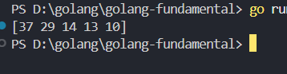
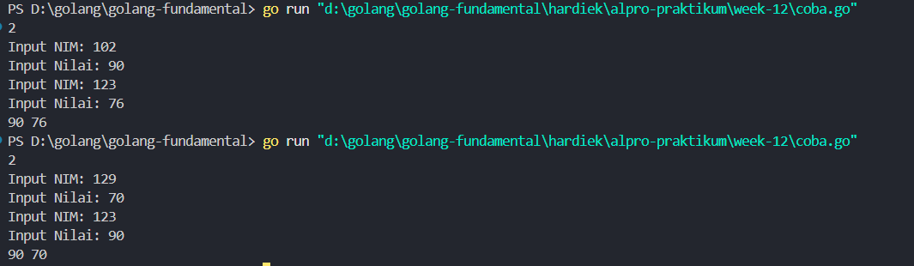
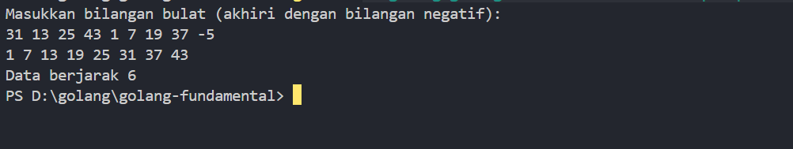
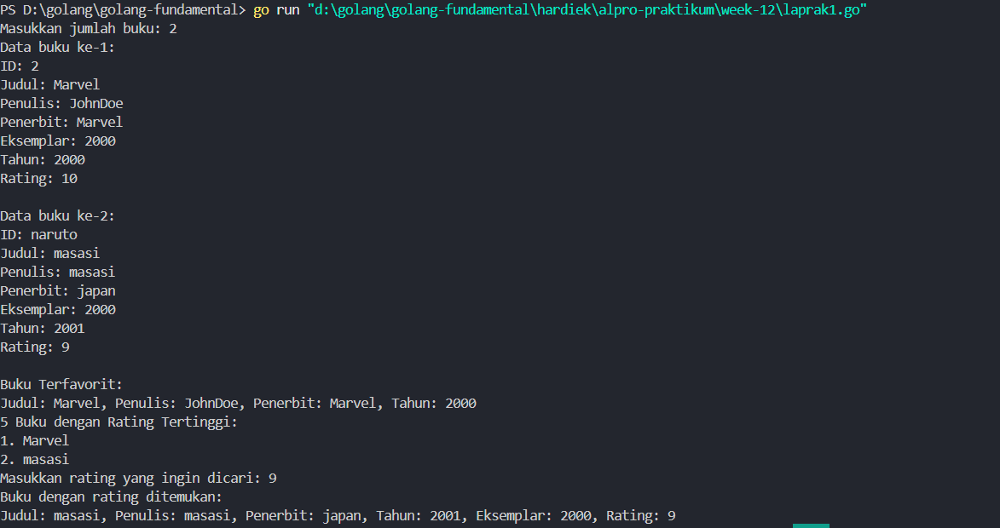

# <h1 align="center">Laporan Praktikum 11&12 <br> MODUL 11&12. Pengurutan Data </h1>
<p align="center">HARDIEK TATENDRA-103112430005</p>

## Dasar Teori

Pengurutan secara seleksi ini idenya adalah mencari nilai ekstrim pada sekumpulan data, kemudian meletakkan pada posisi yang seharusnya. Pada penjelasan berikut ini data akan diurut membesar (ascending), dan data dengan indeks kecil ada di "kiri" dan indeks besar ada di "kanan".

## Guided
### Soal 1

Diberikan `n` bilangan bulat positif. Buat program untuk mengurutkan angka ganjil secara **membesar (ascending)** dan angka genap secara **mengecil (descending)**, lalu gabungkan hasilnya dengan ganjil duluan.

```go
package main

  

import "fmt"

  

func insertionSort(arr []int, panjang int) {

    var temp, i, j int

  

    for i = 1; i < panjang; i++ {

        temp = arr[i]

        j = i

  

        for j > 0 && temp > arr[j-1] {

            arr[j] = arr[j-1]

            j--

        }

  

        arr[j] = temp

    }

}

  

func main() {

    numbers := []int{29, 10, 14, 37, 13}

    insertionSort(numbers, len(numbers))

    fmt.Println(numbers)

}
```

> Output
>

Program di atas dipakai buat ngurutkan angka dari yang terbesar ke yang terkecil. Pertama, saya punya fungsi insertionSort yang menerima array dan panjang arraynya. Di fungsi ini saya pakai variabel temp buat nyimpen nilai sementara, terus i dan j buat iterasi. Logikanya, dari i = 1 sampai akhir array, saya simpen nilai arr[i] ke temp, lalu bandingin temp ini dengan elemen sebelah kiri. Kalau temp lebih besar dari arr[j-1], saya geser arr[j-1] ke kanan sampai ketemu posisi yang pas buat temp. Setelah ketemu, temp saya taruh di posisi yang benar. Jadi ini seperti cara nyisipin nilai ke tempat yang sesuai supaya array tetap terurut dari besar ke kecil. Di fungsi main, saya punya contoh angka, lalu panggil insertionSort buat urutkan, dan terakhir saya cetak hasilnya. Jadi hasil akhirnya adalah array yang sudah terurut menurun.

### Soal 2

Diberikan `n` bilangan bulat positif. Buat program untuk mengurutkan angka ganjil secara **membesar (ascending)** dan angka genap secara **mengecil (descending)**, lalu gabungkan hasilnya dengan ganjil duluan.

```go
package main

  

import "fmt"

  

type Mahasiswa struct {

    nim   int

    nilai int

}

  

func insertionSortDesc(data []Mahasiswa) {

    n := len(data)

    for i := 1; i < n; i++ {

        key := data[i]

        j := i - 1

        for j >= 0 && data[j].nilai < key.nilai {

            data[j+1] = data[j]

            j--

        }

        data[j+1] = key

    }

}

  

func main() {

    var n int

    fmt.Scan(&n)

  

    data := []Mahasiswa{}

    for i := 0; i < n; i++ {

        var nim, nilai int

        fmt.Print("Input NIM: ")

        fmt.Scan(&nim)

        fmt.Print("Input Nilai: ")

        fmt.Scan(&nilai)

        data = append(data, Mahasiswa{nim: nim, nilai: nilai})

    }

  

    insertionSortDesc(data)

  

    for i := 0; i < n; i++ {

        fmt.Print(data[i].nilai, " ")

    }

}
```

> Output
>

Program ini saya buat buat ngurutkan data mahasiswa berdasarkan nilai ujian dari yang terbesar ke yang terkecil. Pertama, saya punya tipe data struct Mahasiswa yang isinya nim dan nilai. Lalu di fungsi main, saya minta input jumlah mahasiswa n.Setelah itu, saya buat array kosong data bertipe Mahasiswa. Saya pakai loop dari 0 sampai n-1 buat input nim dan nilai mahasiswa satu per satu, lalu saya tambahin ke array data pake append.Setelah itu saya panggil fungsi insertionSortDesc yang tugasnya ngurutkan array data berdasarkan nilai secara menurun. Di fungsi itu, saya mulai dari elemen kedua, lalu simpen elemen sekarang ke variabel key. Terus saya bandingin key.nilai dengan elemen-elemen di sebelah kiri, kalau key.nilai lebih besar, saya geser elemen sebelah kiri ke kanan sampai ketemu posisi yang pas buat key, lalu saya pasang key di situ.Terakhir, di main saya tampilkan semua nilai dan nim mahasiswa yang sudah terurut. Jadi hasil akhirnya adalah daftar mahasiswa dari nilai tertinggi sampai terendah, lengkap sama nim-nya.

## Unguided

### Soal 1

Buatlah sebuah program yang digunakan untuk membaca data integer seperti contoh yang diberikan di bawah ini, kemudian diurutkan (menggunakan metoda insertion sort), dan memeriksa apakah data yang terurut berjarak sama terhadap data sebelumnya. Masukan terdiri dari sekumpulan bilangan bulat yang diakhiri oleh bilangan negatif. Hanya bilangan non negatif saja yang disimpan ke dalam array. Keluaran terdiri dari dua baris. Baris pertama adalah isi dari array setelah dilakukan pengurutan, sedangkan baris kedua adalah status jarak setiap bilangan yang ada di dalam array. "Data berjarak x" atau "data berjarak tidak tetap".
```go
package main

  

import (

    "fmt"

)

  

func insertionSort(arr []int) {

    for i := 1; i < len(arr); i++ {

        key := arr[i]

        j := i - 1

        for j >= 0 && arr[j] > key {

            arr[j+1] = arr[j]

            j--

        }

        arr[j+1] = key

    }

}

  

func cekJarakTetap(arr []int) string {

    if len(arr) < 2 {

        return "Data berjarak tidak tetap"

    }

    selisih := arr[1] - arr[0]

    for i := 2; i < len(arr); i++ {

        if arr[i]-arr[i-1] != selisih {

            return "Data berjarak tidak tetap"

        }

    }

    return fmt.Sprintf("Data berjarak %d", selisih)

}

  

func main() {

    var angka []int

    var input int

  

    fmt.Println("Masukkan bilangan bulat (akhiri dengan bilangan negatif):")

    for {

        fmt.Scan(&input)

        if input < 0 {

            break

        }

        angka = append(angka, input)

    }

  

    insertionSort(angka)

  

    for _, v := range angka {

        fmt.Printf("%d ", v)

    }

    fmt.Println()

  

    fmt.Println(cekJarakTetap(angka))

}
```

> Output
> 

Program ini digunakan untuk mengurutkan data bilangan bulat dan mengecek apakah data yang sudah terurut itu punya jarak yang tetap atau nggak. Pertama saya buat dua fungsi, yang pertama insertionSort yang dipakai buat ngurutkan data pakai metode insertion sort. Jadi di fungsi itu saya mulai dari indeks ke-1, ambil nilainya sebagai key, lalu dibandingkan sama data sebelumnya, kalau data sebelumnya lebih besar, digeser ke kanan, begitu terus sampai dapet posisi yang pas buat key-nya. Setelah ketemu posisi yang benar, baru key dimasukin ke situ. Begitu terus sampai semua elemen diurutkan dari kecil ke besar. Fungsi kedua namanya cekJarakTetap, fungsinya buat ngecek apakah selisih antar elemen yang udah terurut itu sama semua. Pertama dicek dulu, kalau panjang datanya kurang dari 2 berarti langsung aja dianggap datanya nggak berjarak tetap karena belum cukup buat dibandingin. Tapi kalau cukup, saya ambil selisih dari dua elemen pertama, terus saya loop dari elemen ketiga sampai akhir. Kalau ada satu aja yang beda selisihnya dari yang awal, berarti langsung dianggap nggak tetap. Tapi kalau semua selisihnya sama, berarti datanya berjarak tetap dan saya cetak “Data berjarak x.Masuk ke program utama, pertama saya deklarasi slice kosong buat nyimpan input user. Saya juga deklarasi satu variabel input bertipe integer buat bantu baca input dari user. Input dijalankan di dalam perulangan tak hingga, dan dihentikan kalau user masukin bilangan negatif. Tapi selama angkanya non-negatif, saya masukin ke slice angka. Setelah selesai input, slice tadi saya urutkan pakai insertionSort, lalu hasilnya saya tampilkan satu per satu. Terakhir saya panggil cekJarakTetap buat ngecek apakah data yang udah diurut itu punya jarak tetap antar elemennya atau enggak, dan hasilnya ditampilkan juga.

### Soal 2
Sebuah program perpustakaan digunakan untuk mengelola data buku di dalam suatu perpustakaan. Misalnya terdefinisi struct dan array seperti berikut ini: const nMax : integer = 7919 type Buku = < id, judul, penulis, penerbit : string eksemplar, tahun, rating : integer > type DaftarBuku = array [ 1..nMax] of Buku Pustaka : DaftarBuku nPustaka: integer Masukan terdiri dari beberapa baris. Baris pertama adalah bilangan bulat N yang menyatakan banyaknya data buku yang ada di dalam perpustakaan. N baris berikutnya, masing-masingnya adalah data buku sesuai dengan atribut atau field pada struct. Baris terakhir adalah bilangan bulat yang menyatakan rating buku yang akan dicari. Halaman 9 | M o d u l P r a k t i k u m A l g o r i t m a P e m r o g r a m a n Keluaran terdiri dari beberapa baris. Baris pertama adalah data buku terfavorit, baris kedua adalah lima judul buku dengan rating tertinggi, selanjutnya baris terakhir adalah data buku yang dicari sesuai rating yang diberikan pada masukan baris terakhir

```go
package main

  

import "fmt"

  

const nMax int = 7919

  

type Buku struct {

    id, judul, penulis, penerbit string

    eksemplar, tahun, rating     int

}

  

type DaftarBuku [nMax]Buku

  

func DaftarkanBuku(pustaka *DaftarBuku, n int) {

    for i := 0; i < n; i++ {

        fmt.Printf("Data buku ke-%d:\n", i+1)

        fmt.Print("ID: ")

        fmt.Scan(&pustaka[i].id)

        fmt.Print("Judul: ")

        fmt.Scan(&pustaka[i].judul)

        fmt.Print("Penulis: ")

        fmt.Scan(&pustaka[i].penulis)

        fmt.Print("Penerbit: ")

        fmt.Scan(&pustaka[i].penerbit)

        fmt.Print("Eksemplar: ")

        fmt.Scan(&pustaka[i].eksemplar)

        fmt.Print("Tahun: ")

        fmt.Scan(&pustaka[i].tahun)

        fmt.Print("Rating: ")

        fmt.Scan(&pustaka[i].rating)

        fmt.Println()

    }

}

  

func CetakTerfavorit(pustaka DaftarBuku, n int) {

    if n == 0 {

        fmt.Println("Tidak ada data buku.")

        return

    }

    maxRating := pustaka[0].rating

    index := 0

    for i := 1; i < n; i++ {

        if pustaka[i].rating > maxRating {

            maxRating = pustaka[i].rating

            index = i

        }

    }

    b := pustaka[index]

    fmt.Println("Buku Terfavorit:")

    fmt.Printf("Judul: %s, Penulis: %s, Penerbit: %s, Tahun: %d\n", b.judul, b.penulis, b.penerbit, b.tahun)

}

  

func UrutBuku(pustaka *DaftarBuku, n int) {

    for i := 1; i < n; i++ {

        key := pustaka[i]

        j := i - 1

        for j >= 0 && pustaka[j].rating < key.rating {

            pustaka[j+1] = pustaka[j]

            j--

        }

        pustaka[j+1] = key

    }

}

  

func Cetak5Terbaru(pustaka DaftarBuku, n int) {

    fmt.Println("5 Buku dengan Rating Tertinggi:")

    limit := 5

    if n < 5 {

        limit = n

    }

    for i := 0; i < limit; i++ {

        fmt.Printf("%d. %s\n", i+1, pustaka[i].judul)

    }

}

  

func CariBuku(pustaka DaftarBuku, n int, r int) {

    low := 0

    high := n - 1

    found := false

  

    for low <= high {

        mid := (low + high) / 2

        if pustaka[mid].rating == r {

            b := pustaka[mid]

            fmt.Println("Buku dengan rating ditemukan:")

            fmt.Printf("Judul: %s, Penulis: %s, Penerbit: %s, Tahun: %d, Eksemplar: %d, Rating: %d\n",

                b.judul, b.penulis, b.penerbit, b.tahun, b.eksemplar, b.rating)

            found = true

            break

        } else if pustaka[mid].rating < r {

            high = mid - 1

        } else {

            low = mid + 1

        }

    }

  

    if !found {

        fmt.Println("Tidak ada buku dengan rating seperti itu.")

    }

}

  

func main() {

    var pustaka DaftarBuku

    var n int

  

    fmt.Print("Masukkan jumlah buku: ")

    fmt.Scan(&n)

  

    DaftarkanBuku(&pustaka, n)

    UrutBuku(&pustaka, n)

    CetakTerfavorit(pustaka, n)

    Cetak5Terbaru(pustaka, n)

  

    var cariRating int

    fmt.Print("Masukkan rating yang ingin dicari: ")

    fmt.Scan(&cariRating)

    CariBuku(pustaka, n, cariRating)

}
```

> Output
>

Program ini saya buat untuk ngelola data buku di perpustakaan, mulai dari input data buku, nyari buku dengan rating tertinggi, ngurutkan data berdasarkan rating, nampilin 5 buku terbaik, sampai nyari buku berdasarkan rating yang diinput user. Pertama saya punya const nMax sebagai batas maksimal jumlah buku yang bisa disimpan, terus saya bikin tipe bentukan Buku yang isinya id, judul, penulis, penerbit, eksemplar, tahun, sama rating. Nah tipe Buku ini saya simpen dalam array DaftarBuku yang ukurannya nMax.Masuk ke program utama, pertama saya minta input jumlah buku (disimpan di variabel n), lalu lanjut ke DaftarkanBuku. Di situ saya pake for loop buat input semua data buku satu per satu, mulai dari ID sampai rating-nya. Setelah datanya masuk, saya panggil UrutBuku buat ngurutkan semua data buku berdasarkan rating-nya dari yang paling besar ke kecil. Metodenya pake insertion sort, jadi saya bandingin satu-satu dan geser elemen ke kanan kalau rating sebelumnya lebih kecil dari key-nya. Setelah data terurut, saya panggil CetakTerfavorit buat nampilin buku dengan rating tertinggi. Jadi saya cari elemen dengan rating paling besar, terus cetak info judul, penulis, penerbit, dan tahunnya. Lanjut ke Cetak5Terbaru, di sini saya nampilin maksimal 5 judul buku dengan rating paling tinggi dari data yang udah diurut tadi. Tapi kalau datanya kurang dari 5, ya ditampilin sebanyak yang ada aja. Terakhir ada CariBuku, ini fungsinya buat nyari buku berdasarkan rating yang diminta user. Karena datanya udah terurut, saya pake pencarian biner (binary search), jadi lebih efisien. Kalau ketemu rating yang cocok, langsung dicetak semua info bukunya. Tapi kalau gak ketemu, ditulis aja “Tidak ada buku dengan rating seperti itu.”Intinya program ini saya buat biar bisa bantu manajemen buku di perpustakaan dengan fitur-fitur yang penting kayak input, sortir, dan cari buku, tapi tetap sederhana dan efektif.
