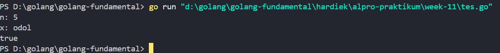
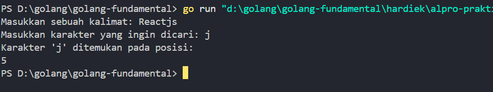
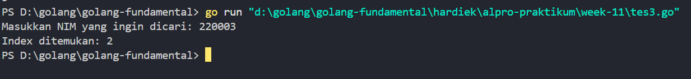
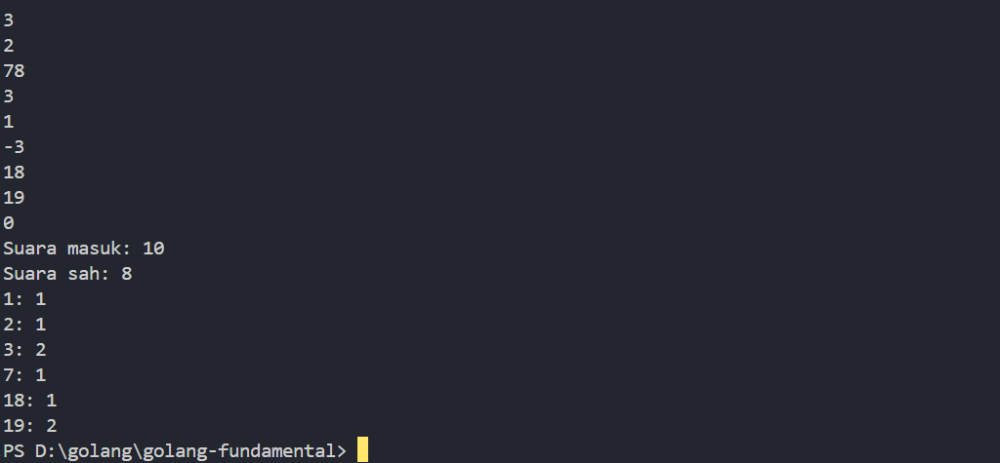
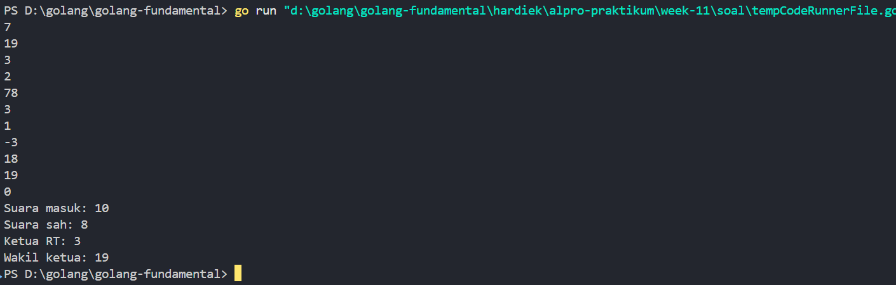
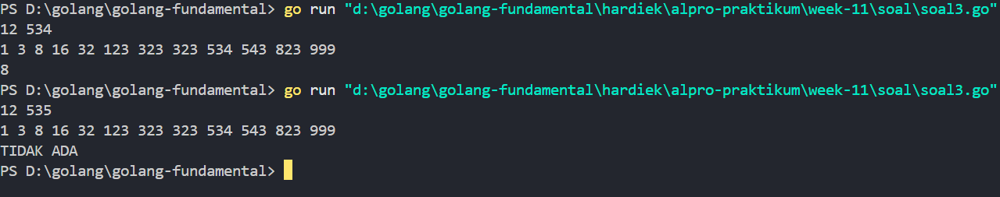

# <h1 align="center">Laporan Praktikum 11 <br> MODUL 11
PENCARIAN NILAI ACAK PADA HIMPUNAN DATA </h1>
<p align="center">HARDIEK TATENDRA-103112430005</p>

## Dasar Teori

Pencarian secara sekuensial ini adalah pencarian yang dilakukan dari data pertama, kedua hingga terakhir secara satu persatu dan berurutan. Ciri khas dari pencarian ini adalah proses pencarian akan berhenti ketika data yang dicari ditemukan, walaupun masih terdapat data yang belum dicek nilainya. Algoritma ini dikenal dengan nama Sequential Search
## Guided
### Soal1
``` go
package main

  

import "fmt"

  

func sequentialSearch(array []string, target string) bool {

  

    for i := 0; i < len(array); i++ {

        if array[i] == target {

            return true

        }

    }

    return false

}

func main() {

  

    data := [5]string{"sabun", "sampo", "odol", "tisu", "minyak"}

  

    x := "odol"

  

    fmt.Println("n:", len(data))

    fmt.Println("x:", x)

    var hasilSearch = sequentialSearch(data[:], x)

  

    fmt.Println(hasilSearch)

  

}

```

> Output
> 

Program diatas digunakan untuk mencari data odol didalam array menggunakan squential search. Pertama saya punya fungsi squentialSearch yang memiliki parameter array dengan total element 5  dimana  fungsi ini mengembalikan boolean true or false, lanjut ke loop,loop ini  berjalan dari i = 0 sampai i < panjang array, setiap literasi array ke i akan dibandingkan dengan target dimana jika array ke i sama dengan target, jika target ketemu maka program akan mengembalikan nilai true jika tidak ketemu false. Lanjut ke program utama disini saya mendeklerasikan array  dengan total element array 5 dengan tipe data string  selanjutnya saya membuat variable x dimana x nanti berperan sebagai parameter aktual dari target, selanjutnya saya print  data yg dicari dan saya membuat variable hasilsearc dimana kita panggil fungsi squential search lalu kita cetak hasilnya
### Soal2
``` go
package main

  

import "fmt"

  

func main() {

    var kalimat string

    var karakter string

  

    fmt.Print("Masukkan sebuah kalimat: ")

    fmt.Scanln(&kalimat)

  

    fmt.Print("Masukkan karakter yang ingin dicari: ")

    fmt.Scanln(&karakter)

  

    if len(karakter) != 1 {

        fmt.Println("Harap masukkan hanya satu karakter!")

        return

    }

  

    var posisi []int

    for i, c := range kalimat {

        if string(c) == karakter {

            posisi = append(posisi, i)

        }

    }

  

    if len(posisi) > 0 {

        fmt.Printf("Karakter '%s' ditemukan pada posisi:\n", karakter)

        for _, pos := range posisi {

            fmt.Println(pos)

        }

    } else {

        fmt.Printf("Karakter '%s' tidak ditemukan dalam kalimat.\n", karakter)

    }

}
```

> Output
> 

Program di atas digunakan untuk mencari karakter tertentu dalam sebuah kalimat. Pertama, saya mendeklarasikan dua variable yaitu kalimat dan karakter, dimana kalimat digunakan untuk menyimpan input berupa kalimat dari user dan karakter untuk menyimpan karakter yang ingin dicari dalam kalimat tersebut. Untuk input, saya menggunakan fmt.Scanln, yang akan membaca input dari user, lalu lanjut ke bagian validasi dimana dicek panjang karakter yang dimasukkan, kalau lebih dari satu karakter maka program akan berhenti dan munculkan pesan "Harap masukkan hanya satu karakter!".Selanjutnya saya buat array dinamis posisi yang digunakan untuk menyimpan index di mana karakter ditemukan. Lalu saya masuk ke loop for, di sini saya pakai range yang otomatis memberikan index dan karakter dari string kalimat. Setiap karakter diubah jadi string, lalu dibandingkan dengan karakter yang dimasukkan user. Kalau cocok, maka index-nya ditambahkan ke slice posisi menggunakan append.Terakhir, program akan cek isi dari `posisi`. Kalau panjangnya lebih dari 0, artinya karakter ditemukan, maka saya print semua posisi karakter tersebut dalam kalimat. Tapi kalau tidak ada, maka akan keluar pesan karakter tidak ditemukan dalam kalimat.

### Soal3
``` go
package main

  

import "fmt"

  

type mahasiswa struct {

    nama string

    nim  int

}

  

type MAX_ARRAY [100]mahasiswa

  

func cariMahasiswa(data MAX_ARRAY, jumlah int, targetNIM int) int {

    low := 0

    high := jumlah - 1

  

    for low <= high {

        mid := (low + high) / 2

  

        if data[mid].nim == targetNIM {

            return mid

        } else if data[mid].nim < targetNIM {

            low = mid + 1

        } else {

            high = mid - 1

        }

    }

  

    return -1

}

  

func main() {

    var data MAX_ARRAY

    var jumlah int = 4

  

    data[0] = mahasiswa{nama: "Andi", nim: 220001}

    data[1] = mahasiswa{nama: "Budi", nim: 220002}

    data[2] = mahasiswa{nama: "Citra", nim: 220003}

    data[3] = mahasiswa{nama: "Dina", nim: 220004}

  

    var targetNIM int

    cariMahasiswa(data, jumlah, targetNIM)

  

    fmt.Print("Masukkan NIM yang ingin dicari: ")

    fmt.Scan(&targetNIM)

  

    index := cariMahasiswa(data, jumlah, targetNIM)

  

    if index >= 0 {

        fmt.Printf("Index ditemukan: %d\n", index)

    } else {

        fmt.Println("NIM tidak ditemukan.")

    }

}
```

> Output
> 

Program di atas digunakan untuk mencari data mahasiswa berdasarkan NIM menggunakan binary search. Pertama, saya buat tipe data struct mahasiswa yang punya dua properti, yaitu nama bertipe string dan nim bertipe int. Struct ini mewakili satu data mahasiswa. Selanjutnya saya buat alias MAX_ARRAY sebagai array tetap yang isinya maksimal 100 elemen bertipe mahasiswa.
Lanjut ke fungsi cariMahasiswa, fungsi ini bertugas untuk mencari data mahasiswa berdasarkan NIM yang dicari. Fungsi ini menerima 3 parameter: array data bertipe MAX_ARRAY, jumlah data jumlah bertipe int, dan targetNIM yang akan dicari. Fungsi ini akan mengembalikan index posisi mahasiswa jika ditemukan, atau -1 kalau tidak ketemu. Di dalamnya saya pakai teknik binary search yaitu pencarian yang lebih cepat karena data sudah terurut berdasarkan nim. Saya pakai dua variabel pembatas low dan high, lalu cari titik tengahnya dengan (low + high) / 2. Kalau nim di tengah cocok dengan targetNIM, maka return mid. Kalau lebih kecil, pencarian pindah ke kanan. Kalau lebih besar, pindah ke kiri.Lanjut ke fungsi main. Di sini saya deklarasikan array data bertipe MAX_ARRAY, dan jumlah datanya saya isi manual sebanyak 4 mahasiswa. Saya isi masing-masing elemen array dengan data mahasiswa berupa nama dan nim. Misalnya data[0] diisi mahasiswa dengan nama "Andi" dan NIM 220001, dan seterusnya sampai "Dina".Setelah data tersedia, program minta input dari user berupa NIM yang ingin dicari. Input ini disimpan di variable targetNIM. Setelah itu saya panggil fungsi cariMahasiswa dengan parameter data array, jumlah data, dan targetNIM. Nilai return-nya disimpan ke dalam variable index.Terakhir  cek isi dari index. Kalau nilainya lebih dari sama dengan 0, berarti NIM ditemukan dan saya cetak posisi index-nya. Tapi kalau -1, berarti NIM yang dimasukkan tidak ditemukan dalam data mahasiswa.


## Unguided

### Soal 1

Pada pemilihan ketua RT yang baru saja berlangsung, terdapat 20 calon ketua yang bertanding memperebutkan suara warga. Perhitungan suara dapat segera dilakukan karena warga cukup mengisi formulir dengan nomor dari calon ketua RT yang dipilihnya. Seperti biasa, selalu ada pengisian yang tidak tepat atau dengan nomor pilihan di luar yang tersedia, sehingga data juga harus divalidasi. Tugas Anda untuk membuat program mencari siapa yang memenangkan pemilihan ketua RT. Buatlah program pilkart yang akan membaca, memvalidasi, dan menghitung suara yang diberikan dalam pemilihan ketua RT tersebut. Masukan hanya satu baris data saja, berisi bilangan bulat valid yang kadang tersisipi dengan data tidak valid. Data valid adalah integer dengan nilai di antara 1 s.d. 20 (inklusif). Data berakhir jika ditemukan sebuah bilangan dengan nilai 0. Keluaran dimulai dengan baris berisi jumlah data suara yang terbaca, diikuti baris yang berisi berapa banyak suara yang valid. Kemudian sejumlah baris yang mencetak data para calon apa saja yang mendapatkan suara

```go
package main

  

import "fmt"

  

func main() {

    var suara [21]int

    suaraMasuk, suaraSah := prosesSuara(&suara)

    tampilkanHasil(suaraMasuk, suaraSah, suara)

}

  

func prosesSuara(suara *[21]int) (int, int) {

    var nomor int

    var suaraMasuk int = 0

    var suaraSah int = 0

  

    for {

        fmt.Scan(&nomor)

        if nomor == 0 {

            break

        }

        suaraMasuk++

        if nomor >= 1 && nomor <= 20 {

            suara[nomor]++

            suaraSah++

        }

    }

  

    return suaraMasuk, suaraSah

}

  

func tampilkanHasil(suaraMasuk, suaraSah int, suara [21]int) {

    fmt.Printf("Suara masuk: %d\n", suaraMasuk)

    fmt.Printf("Suara sah: %d\n", suaraSah)

    for i := 1; i <= 20; i++ {

        if suara[i] > 0 {

            fmt.Printf("%d: %d\n", i, suara[i])

        }

    }

}
```

> Output
> 

Program di atas digunakan untuk menghitung pilihar rt. Pertama saya mendeklerasikan variable suara dengan total 21 index dan dimulai dari 1 karena calon mulai dari index 1, dan punya dua variable suara masuk dan suara sah yang digunakan untuk memangil proses suarra,lalu memangil tampilkanHasil untuk mencetak hasilnya. Kita masuk ke fungsi proses suara dimana memiliki parameter suara dengan array yg menampung 21 index, kemudian fungsi ini mengembalikan tipe data integer. Masuk ke fungsi saya punya variable num untuk menyimpan input user, selanjutnya suaraMasuk digunakan untuk menampung suara yang masuk dan suara sah hanya menampung suara yang sah saja masuk ke for disini kita digunakan untuk perulangan dimana didalamnya terdapat input sebagai input user, for disini akan terus melakukan perulangan hingga user memasukan nilai 0 karena jika num == 0 maka break. Selanjutnya **if num >= 1 && num <= 20** nah bagian ini digunakan untuk pengecekan apakah suara sah atau tidak dimana number lebih dari 1 dan number kurang dari sama dengan 20, misal user input num -1 atau 0 maka blok tersebut tidak menyimpan suara untuk calon dan suara yang sah. dan fungsi ini mengembalikan dua nilai yaitu suara masuk dan suara sah.fungsi tampilkanHasil  dimana memiliki parameter, suaraMasuk, suaraSah, dan array suara. Lanjut ke blok kode nya disini ada dua print untuk mencetak suara sah dan masuk. Masuk loop, loop ini akan memriksa setiap calon nomer 1 hingga 20, lalu ada if dimana if ini digunakan untuk pengecekan apakah suara sah jika sah maka akan disimpan di array.

### Soal 2
Berdasarkan program sebelumnya, buat program pilkart yang mencari siapa pemenang pemilihan ketua RT. Sekaligus juga ditentukan bahwa wakil ketua RT adalah calon yang mendapatkan suara terbanyak kedua. Jika beberapa calon mendapatkan suara terbanyak yang Halaman 8 | M o d u l P r a k t i k u m A l g o r i t m a P e m r o g r a m a n sama, ketua terpilih adalah dengan nomor peserta yang paling kecil dan wakilnya dengan nomor peserta terkecil berikutnya. Masukan hanya satu baris data saja, berisi bilangan bulat valid yang kadang tersisipi dengan data tidak valid. Data valid adalah bilangan bulat dengan nilai di antara 1 s.d. 20 (inklusif). Data berakhir jika ditemukan sebuah bilangan dengan nilai 0. Keluaran dimulai dengan baris berisi jumlah data suara yang terbaca, diikuti baris yang berisi berapa banyak suara yang valid. Kemudian tercetak calon nomor berapa saja yang menjadi pasangan ketua RT dan wakil ketua RT yang baru

```go
package main

  

import "fmt"

  

func main() {

    var suara [21]int

    suaraMasuk, suaraSah := prosesSuara(&suara)

    tampilkanHasil(suaraMasuk, suaraSah, suara)

  

    ketua, wakil := cariKetuaWakilSeq(suara)

    fmt.Printf("Ketua RT: %d\n", ketua)

    fmt.Printf("Wakil ketua: %d\n", wakil)

}

  

func prosesSuara(suara *[21]int) (int, int) {

    var num int

    suaraMasuk, suaraSah := 0, 0

  

    for {

        fmt.Scan(&num)

        if num == 0 {

            break

        }

        suaraMasuk++

        if num >= 1 && num <= 20 {

            suara[num]++

            suaraSah++

        }

    }

    return suaraMasuk, suaraSah

}

  

func tampilkanHasil(suaraMasuk, suaraSah int, suara [21]int) {

    fmt.Printf("Suara masuk: %d\n", suaraMasuk)

    fmt.Printf("Suara sah: %d\n", suaraSah)

}

  

func cariKetuaWakilSeq(suara [21]int) (int, int) {

    max1, max2 := 0, 0

    index1, index2 := 0, 0

  

    for i := 1; i <= 20; i++ {

        if suara[i] > max1 {

            max2, index2 = max1, index1

            max1, index1 = suara[i], i

        } else if suara[i] == max1 && i < index1 {

            max2, index2 = max1, index1

            max1, index1 = suara[i], i

        } else if suara[i] > max2 {

            max2, index2 = suara[i], i

        } else if suara[i] == max2 && i < index2 {

            index2 = i

        }

    }

    return index1, index2

}
```

> Output
> 

Program di atas digunakan untuk mencari siapa pemenang pemilihan Rt dengen squential search. ini masih lanjutan dari soal 1 yang dimana kita tadi telah membuat program menghitung suara sah mungkin bagian ini saya hanya akan menjelaskan bagian squential search nya saja . Langsung masuk ke fungsi cariKetuaWakilseq dimana saya hanya membuat 1 parameter yaitu suara karena tujuan saya hanya akan mencari siapa suara terbenyak, selanjutnya saya membuat dua variable max1 dan max2 ini digunakan untuk suara terbanyak dan suara terbanyak ke 2 sedangkan index1 dan index2 adalah index calong yang memiliki sura terbanyak ke 1 dan 2. Masuk ke loop program akan memeriksa setiap calon dari 1 hingga 20. Masuk ke kondisi if pertama  jika suara calon ke-i lebih besar dari max1 maka max2 dan index2 diperbarui dengan max1 dan index1 sebelumnya dan max1 dan index1 nilai sementaranya  adalah suara calon ke i dan index calon ke i. Masuk ke kondisi if kedua Jika suara calon ke-i sama dengan `max1` dan nomor calon lebih kecil - Jika ada calon yang memiliki jumlah suara sama dengan `max1`, maka dipilih yang memiliki nomor calon lebih kecil (nomor calon yang lebih kecil menjadi Ketua RT). Jadi, max2 dan index2 diperbarui, begitu juga max1 dan index1. Lanjut ke kondisi if selanjutnya Jika calon ke-i memiliki suara lebih besar dari max2 (tapi lebih kecil dari max1), maka calon tersebut menjadi calon dengan suara terbanyak kedua, Yang terakhir jika suara calon ke-i sama dengan max2 dan nomor calon lebih kecil maka  Jika ada dua calon yang memiliki jumlah suara sama dengan max2, pilih yang nomor calonnya lebih kecil.
### Soal 3

Diberikan n data integer positif dalam keadaan terurut membesar dan sebuah integer lain k, apakah bilangan k tersebut ada dalam daftar bilangan yang diberikan? Jika ya, berikan indeksnya, jika tidak sebutkan "TIDAK ADA". Masukan terdiri dari dua baris. Baris pertama berisi dua buah integer positif, yaitu n dan k. n menyatakan banyaknya data, dimana 1 < n <= 1000000. k adalah bilangan yang ingin dicari. Baris kedua berisi n buah data integer positif yang sudah terurut membesar. Keluaran terdiri dari satu baris saja, yaitu sebuah bilangan yang menyatakan posisi data yang dicari (k) dalam kumpulan data yang diberikan. Posisi data dihitung dimulai dari angka 0. Atau memberikan keluaran "TIDAK ADA" jika data k tersebut tidak ditemukan dalam kumpulan.

```go
package main

  

import "fmt"

  

const NMAX = 1000000

  

var data [NMAX]int

  

func isiArray(n int) {

    for i := 0; i < n; i++ {

        fmt.Scan(&data[i])

    }

}

  

func posisi(n, k int) int {

    low, high := 0, n-1

  

    for low <= high {

        mid := (low + high) / 2

        if data[mid] == k {

            return mid

        } else if data[mid] < k {

            low = mid + 1

        } else {

            high = mid - 1

        }

    }

  

    return -1

}

  

func main() {

    var n, k int

    fmt.Scan(&n, &k)

  

    isiArray(n)

  

    searcPosisi := posisi(n, k)

  

    if searcPosisi != -1 {

        fmt.Println(searcPosisi)

    } else {

        fmt.Println("TIDAK ADA")

    }

}
```

> Output
>

Program di atas digunakan untuk mencari posisi bilangan tertentu dari sekumpulan data yang sudah terurut secara membesar. Pertama saya mendeklarasikan sebuah array data yang memiliki kapasitas maksimum sebanyak satu juta elemen, karena nilai n bisa sampai satu juta. Lalu masuk ke fungsi main, saya mendeklarasikan dua variabel n dan k, di mana n adalah jumlah elemen dalam array dan k adalah bilangan yang ingin dicari. Nilai n dan k diinput oleh user dengan fmt.Scan, setelah itu saya memanggil fungsi isiArray(n) yang digunakan untuk mengisi array data sebanyak n data dari input.Fungsi `isiArray` ini sendiri punya satu parameter yaitu `n`, dan fungsinya simpel, hanya mengisi array `data` sebanyak `n` angka dari input user, dengan menggunakan perulangan `for` dari 0 sampai kurang dari `n`.Setelah array terisi, kita masuk ke bagian pencarian posisi k dalam array. Saya menggunakan fungsi posisi(n, k) yang menggunakan metode binary search karena array-nya sudah dalam keadaan terurut. Fungsi ini memiliki dua parameter, yaitu n dan k, dan akan mengembalikan posisi dari elemen k jika ditemukan, atau -1 jika tidak ada. Di dalamnya saya inisialisasi dua batas pencarian yaitu low dan high, lalu menggunakan perulangan for dengan kondisi `low <= high`. Di dalam perulangan tersebut, saya cari nilai tengah mid, lalu dicek apakah `data[mid]` sama dengan `k`. Kalau iya, berarti kita sudah ketemu dan langsung return `mid`. Tapi kalau nilai tengah lebih kecil dari `k`, maka artinya `k` ada di sebelah kanan, jadi saya geser batas bawah `low = mid + 1`. Sebaliknya, kalau nilai tengah lebih besar dari `k`, berarti `k` ada di sebelah kiri, jadi saya geser batas atas `high = mid - 1`. Kalau sampai keluar dari perulangan dan belum ketemu juga, berarti datanya tidak ada, maka return `-1`.Balik lagi ke fungsi `main`, hasil pencarian dari posisi() saya simpan ke dalam variabel searcPosisi. Kemudian dicek lagi, kalau tidak sama dengan -1, berarti datanya ditemukan, jadi saya cetak indeksnya. Tapi kalau -1, berarti data tidak ada, maka saya cetak "TIDAK ADA".
