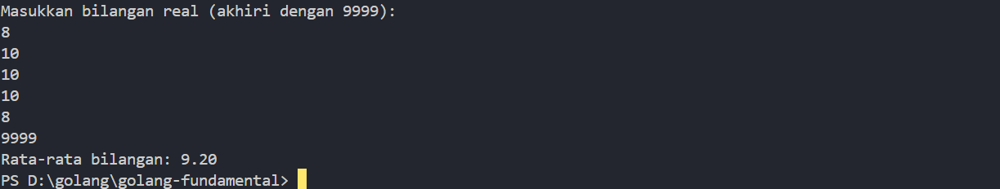

# <h1 align="center">Laporan Praktikum 17 <br> MODUL 17. Skema Skuensial </h1>
<p align="center">HARDIEK TATENDRA-103112430005</p>

## Dasar Teori

Skema Pemrosesan Sekuensial (Sequential Processing Scheme) adalah pola pemrosesan datasecara berurutan dari awal hingga akhir, satu per satu, tanpa melompat-lompat atau berpindah secara acak. Skema ini sangat umum digunakan dalam pemrograman dasar, terutama saat bekerja dengan input atau data yang datang secara bertahap.

### GUIDED
Aldi memiliki daftar nilai ulangan matematika temannya: 75, 60, 90, 85, dan 70. Ia ingin mengurutkan nilai tersebut dari yang terkecil ke yang terbesar menggunakan metode Bubble Sort.

```go
package main

import "fmt"

func bubbleSort(arr []int) (cobaShorted []int, totalSwapCount int) {

    n := len(arr)

    totalSwapCount = 0
  

    for i := 0; i < n-1; i++ {

        for j := 0; j < n-i-1; j++ {

            if arr[j] > arr[j+1] {

                arr[j], arr[j+1] = arr[j+1], arr[j]

                totalSwapCount++

                fmt.Printf("Swap: %v <-> %v -> %v\n", arr[j+1], arr[j], arr)

            }

        }

    }

    return arr, totalSwapCount

}

  

func main() {

    var isiData = []int{75, 60, 90, 85, 70}

    fmt.Println("Daftar sebelum diurutkan:", isiData)

  

    sortedValues, swapCount := bubbleSort(isiData)

  

    fmt.Println("Daftar setelah diurutkan:", sortedValues)

    fmt.Println("Jumlah pertukaran (swap) yang terjadi:", swapCount)

}
```

> Output
>  

Program diatas digunakan untuk melakukan bubble short.Pertama masuk ke fungsi bubbleshort yg menerima array integer sebagai parameter fungsi ini mengembalikan dua nilai cobashorted hasil array yg sudah diurutkan  totalswap adalah total berapa kali menukar pertama inisialsasi  n dengan len(arr) artinya panjang array nya  for luar digunakan untuk melakukan jumlah pass nya kemudian for j digunakan untuk proses membandingkan, kenapa j-i-1? Karena setiap akhir putaran, elemen terbesar sudah "bubble" ke akhir array, jadi tidak perlu dicek lagi. masuk ke if dimana kondisi jika array ke j lebih besar dibanding dari elemen birkutnya j+1 maka tukar atau swap posisinya dan jika kondisi terpenuhi totalswapcount bertambah 1 kemudian return untuk mengembalikan nilai. Masuk program utama disini syaa mendefinisikan isiData untuk menampung array panggil fungsi  bubbleshort lalu Menyimpan hasil sortir dan jumlah swap ke variabel sortedValues dan swapCount lalu print output nya
## Unguided

### Soal 1

Diberikan sejumlah bilangan real yang diakhiri dengan marker 9999, cari rerata dari bilanganbilangan tersebut.

```go
package main

  

import "fmt"

  

func main() {

    var total float64

    var num float64

    count := 0

  

    fmt.Println("Masukkan bilangan real (akhiri dengan 9999):")

  

    for {

        fmt.Scan(&num)

  

        if num == 9999 {

            break

        }

  

        total += num

        count++

    }

  

    if count > 0 {

        rataRata := total / float64(count)

        fmt.Printf("Rata-rata bilangan: %.2f\n", rataRata)

    } else {

        fmt.Println("Tidak ada bilangan yang dimasukkan.")

    }

}
```

> Output
>  

Program di atas digunakan untuk mencari rataar dengan diakhiri marker 9999. Pertama tama saya punya variable total nilai yg digunakan untuk menampung nilai yg di input user, kemudian ada variable num yang digunakan untuk input user nantinya dan  terakhir ada variable count dimana count ini adalah jumlah berapa kali user input misal ketika user input ini nanti nya count akan bertambah  1 1 terus hingga user menginput marker 9999. lanjut saya punya perulangan dimana pada blok baris pertama itu input num , selanjutnya ada percabangan dimana untuk mengakhiri marker dengan value 9999 , selanjutnya ada total += num artinya yaitu setiap num yg di input user akan terus ditambah dan disimpan di total lanjut ke if selanjutnya disini terdapat kondisi jika count > 0 artinya ada data yg di input user yg artinya wajib ada jika kondisii  terepenuhi maka  total input user tadi kita bagi dengan count yaitu berapa kali menginput

### Soal 2
Diberikan string x dan n buah string. x adalah data pertama yang dibaca, n adalah data bilangan yang dibaca kedua, dan n data berikutnya adalah data string. Buat algoritma untuk menjawab pertanyaan berikut: a. Apakah string x ada dalam kumpulan n data string tersebut? b. Pada posisi ke berapa string x tersebut ditemukan?. Ada berapakah string x dalam kumpulan n data string tersebut? d. Adakah sedikitnya dua string x dalam n data string tersebut?

```go
package main


import "fmt"
  

func main() {

    var x string

    var n int
  

    fmt.Print("Masukkan string x: ")

    fmt.Scanln(&x)
  

    fmt.Print("Masukkan jumlah data string n: ")

    fmt.Scanln(&n)
  

    var data [100]string

    fmt.Println("Masukkan", n, "string:")

    for i := 0; i < n; i++ {

        fmt.Scanln(&data[i])

    }

  

    found := false

    var positions [100]int

    count := 0

    posIndex := 0

  

    for i := 0; i < n; i++ {

        if data[i] == x {

            found = true

            positions[posIndex] = i + 1

            posIndex++

            count++

        }

    }

  

    fmt.Println("\nJawaban:")

    fmt.Printf("a. Apakah string x ada? %s\n", toYaTidak(found))

  

    if found {

        fmt.Print("b. Ditemukan pada posisi: ")

        for i := 0; i < posIndex; i++ {

            fmt.Printf("%d ", positions[i])

        }

        fmt.Println()

    } else {

        fmt.Println("b. Tidak ditemukan")

    }

  

    fmt.Printf("c. Jumlah kemunculan string x: %d\n", count)

    fmt.Printf("d. Apakah ada sedikitnya dua string x? %s\n", toYaTidak(count >= 2))

}

  

func toYaTidak(b bool) string {

    if b {

        return "Ya"

    }

    return "Tidak"

}
```

> Output
> 

Program ini dibuat untuk mencari string `x` dalam kumpulan data string yang dimasukkan oleh pengguna. Pertama-tama, kita diminta untuk memasukkan string `x`, yang merupakan string yang akan dicari, dan jumlah data string `n`, yang menyatakan berapa banyak data string yang akan dimasukkan selanjutnya. Setelah itu, program akan meminta kita untuk memasukkan `n` buah string yang akan diperiksa apakah ada yang cocok dengan string `x`.
Di dalam program, ada beberapa variabel yang dideklarasikan: `x` untuk menampung string yang dicari, `n` untuk jumlah data string, `data` yang digunakan untuk menyimpan string-string yang dimasukkan, `found` untuk menandakan apakah string `x` ditemukan atau tidak, `positions` untuk menyimpan posisi-posisi string `x` ditemukan, dan `count` untuk menghitung berapa kali string `x` muncul.Setelah itu, program akan meminta kita untuk memasukkan `n` string, dan setiap string yang dimasukkan akan disimpan ke dalam array `data`. Program kemudian akan memeriksa setiap string yang dimasukkan, apakah ada yang cocok dengan string `x`. Kalau ada, program akan menyimpan posisi string tersebut di array `positions` dan menambahkan angka ke dalam `count` yang menunjukkan berapa kali string `x` muncul.
Setelah semua string diperiksa, program akan menampilkan hasil dengan beberapa pertanyaan:
- **a. Apakah string `x` ada?** Program mengecek apakah ada string yang cocok dengan `x`. Kalau ada, jawabannya "Ya", kalau tidak "Tidak".
- **b. Pada posisi ke berapa string `x` ditemukan?** Kalau ditemukan, posisi-posisi string tersebut akan ditampilkan. Posisi dihitung dari 1, bukan 0.
- **c. Ada berapa banyak string `x`?** Program akan menghitung dan menampilkan berapa kali string `x` muncul dalam kumpulan data tersebut.
- **d. Apakah ada sedikitnya dua string `x`?** Program mengecek apakah ada dua atau lebih kemunculan dari string `x`. Kalau ada, jawabannya "Ya", kalau tidak, jawabannya "Tidak".
Pos Pelayanan Terpadu (posyandu) sebagai tempat pelayanan kesehatan perlu mencatat data berat balita (dalam kg). Petugas akan memasukkan data tersebut ke dalam array. Dari data yang diperoleh akan dicari berat balita terkecil, terbesar, dan reratanya.
### Soal 3
Empat daerah A, B, C, dan D yang berdekatan ingin mengukur curah hujan. Keempat daerah tersebut digambarkan pada bidang berikut: Gambar 1. Ilustrasi denah daerah yang digunakan untuk mengukur curah hujan Misal curah hujan dihitung berdasarkan banyaknya tetesan air hujan. Setiap tetesan berukuran 0.0001 ml curah hujan. Tetesan air hujan turun secara acak dari titik (0,0) sampai (1,1). Jika diterima input yang menyatakan banyaknya tetesan air hujan. Tentukan curah hujan untuk keempat daerah tersebut. Buatlah program yang menerima input berupa banyaknya tetesan air hujan. Kemudian buat koordinat/titik (x, y) secara acak dengan menggunakan fungsi rand.Float64(). Hitung dan tampilkan banyaknya tetesan yang jatuh pada daerah A, B, C dan D. Konversikan satu tetesan berukuran 0.0001 milimeter. Catatan: Lihat lampiran untuk informasi menggunakan paket math/rand untuk menggunakan rand.Float64() yang menghasilkan bilangan riil acak [0..1]. Berikut contoh masukan dan keluarannya: No Masukan Keluaran 1 10000000 Curah hujan daerah A: 250.0066 milimeter Curah hujan daerah B: 249.8981 milimeter Curah hujan daerah C: 249.9930 milimeter Curah hujan daerah D: 250.1023 milimeter

```go
package main

  

import (

    "fmt"

    "math/rand"

)

  

func main() {

    var n int

    fmt.Print("Masukkan jumlah tetesan air hujan: ")

    fmt.Scan(&n)

  

    rand.Seed(1)

  

    a, b, c, d := 0, 0, 0, 0

    for i := 0; i < n; i++ {

        x := rand.Float64()

        y := rand.Float64()

  

        if x < 0.5 && y >= 0.5 {

            a++

        } else if x >= 0.5 && y >= 0.5 {

            b++

        } else if x < 0.5 && y < 0.5 {

            c++

        } else {

            d++

        }

    }

  

    const tetesanKeMilimeter = 0.0001

    fmt.Printf("Curah hujan daerah A: %.4f milimeter\n", float64(a)*tetesanKeMilimeter)

    fmt.Printf("Curah hujan daerah B: %.4f milimeter\n", float64(b)*tetesanKeMilimeter)

    fmt.Printf("Curah hujan daerah C: %.4f milimeter\n", float64(c)*tetesanKeMilimeter)

    fmt.Printf("Curah hujan daerah D: %.4f milimeter\n", float64(d)*tetesanKeMilimeter)

}
```

> Output
> 

Program diatas adalah program untuk mencari curah hujan pertama saya punya variable n menyimpan air hujan yg akan dihitung , a,b,c,d kemudian a,b,c,d ini kita inisialisasi  dengan nilai awal 0 semua, selanjutnya masuk ke for  Pada bagian ini, kita menggunakan perulangan `for` untuk menghasilkan `n` titik acak dengan koordinat `(x, y)`. Fungsi `rand.Float64()` menghasilkan angka acak real antara 0 dan 1, yang digunakan untuk menentukan posisi titik dalam ruang koordinat (0, 0) hingga (1, 1).
 Kemudian, berdasarkan nilai `x` dan `y`, kita menentukan titik tersebut jatuh di daerah mana:
- **Daerah A**: `x < 0.5` dan `y >= 0.5` (kuadran kiri atas)        
- **Daerah B**: `x >= 0.5` dan `y >= 0.5` (kuadran kanan atas)
- **Daerah C**: `x < 0.5` dan `y < 0.5` (kuadran kiri bawah)     
- **Daerah D**: `x >= 0.5` dan `y < 0.5` (kuadran kanan bawah)
Setiap kali titik jatuh pada salah satu daerah, kita menambahkan angka ke variabel yang sesuai (a, b, c, atau d). Selanjutnya saya mendeklerasikan konstanta dimana nilai nya tidak berubah yang menyatakan ukuran satu tetesan air hujan dalam milimeter, yaitu 0.0001 ml. Kemudian kita menghitung dan menampilkan curah hujan untuk masing-masing daerah dengan mengalikan jumlah tetesan yang jatuh di setiap daerah dengan tetesanKeMilimeter. Hasilnya ditampilkan dengan format desimal 4 tempat.

Program ini digunakan untuk menghitung nilai π dengan menggunakan deret Leibniz. Pertama, saya minta input dari pengguna berupa jumlah suku maksimum yang ingin dihitung, yang disimpan dalam variabel `n`. Lalu, saya inisialisasi beberapa variabel, seperti `sukuSekarang` untuk menyimpan nilai suku yang sedang dihitung, `sukuBerikut` untuk menyimpan nilai suku berikutnya, dan `pi` untuk menyimpan total perhitungan nilai π yang sementara. Di dalam perulangan, program akan menghitung setiap suku dengan memeriksa apakah indeks suku tersebut ganjil atau genap. Jika indeksnya ganjil, suku yang dihitung adalah 1/angka ganjil, dan jika indeksnya genap, suku yang dihitung adalah negatif 1/angka ganjil. Setiap suku yang dihitung akan ditambahkan ke variabel `pi`, yang pada akhirnya akan dikalikan 4 untuk memperoleh nilai π yang diperkirakan.

### Soal 4
Berdasarkan formula Leibniz, nilai π dapat dinyatakan sebagai deret harmonik ganti sebagai berikut: 1 − 1/ 3 + 1/ 5 − 1 /7 + 1/ 9 − ⋯ = 𝜋 4 Suku ke-i dinyatakan sebagai 𝑆𝑖 dan jumlah deret adalah 𝑆. Apabila diketahui suku pertama 𝑆1 = 1, suku kedua 𝑆2 = −1 3 . Temukan rumus untuk suku ke-𝒊 atau 𝑆𝑖 . Berdasarkan rumus tersebut, buatlah program yang menghitung 𝑆 untuk 1000000 suku pertama. Perhatikan contoh sesi interaksi program di bawah ini (teks bergaris bawah adalah input/read): N suku pertama: 1000000 Hasil PI: 3.1415951 Setelah jalan, modifikasi program tersebut agar menyimpan nilai dua suku yang bersebelahan, 𝑆𝑖 dan 𝑆𝑖+1. Buatlah agar program tersebut sekarang berhenti apabila selisih dari kedua suku tersebut tidak lebih dari 0.00001. Perhatikan contoh sesi interaksi program di bawah ini (teks bergaris bawah adalah input/read): N suku pertama: 1000000 Hasil PI: 3.1415876535 Hasil PI: 3.1415976535 Pada i ke: 200002

```go
package main

  

import (

    "fmt"

    "math"

)

  

func main() {

    var n int

    fmt.Print("N suku maksimum: ")

    fmt.Scan(&n)

  

    var sukuSekarang, sukuBerikut, pi float64

    var i int

    pi = 0.0

  

    for i = 1; i <= n; i++ {

        if i%2 == 1 {

            sukuSekarang = 1.0 / float64(2*i-1)

        } else {

            sukuSekarang = -1.0 / float64(2*i-1)

        }

        nextI := i + 1

        if nextI%2 == 1 {

            sukuBerikut = 1.0 / float64(2*nextI-1)

        } else {

            sukuBerikut = -1.0 / float64(2*nextI-1)

        }

  

        if math.Abs(sukuSekarang-sukuBerikut) < 0.00001 {

            break

        }

  

        pi += sukuSekarang

    }

  

    piPertama := pi * 4

    piKedua := (pi + sukuBerikut) * 4

    fmt.Printf("Hasil PI: %.10f\n", piPertama)

    fmt.Printf("Hasil PI: %.10f\n", piKedua)

    fmt.Printf("Pada i ke: %d\n", i)

}
```

> Output
> 


Program ini digunakan untuk menghitung nilai π dengan menggunakan deret Leibniz. Pertama, saya minta input dari pengguna berupa jumlah suku maksimum yang ingin dihitung, yang disimpan dalam variabel n. Lalu, saya inisialisasi beberapa variabel, seperti sukuSekarang untuk menyimpan nilai suku yang sedang dihitung, sukuBerikut untuk menyimpan nilai suku berikutnya, dan pi untuk menyimpan total perhitungan nilai π yang sementara. Di dalam perulangan, program akan menghitung setiap suku dengan memeriksa apakah indeks suku tersebut ganjil atau genap. Jika indeksnya ganjil, suku yang dihitung adalah 1/angka ganjil, dan jika indeksnya genap, suku yang dihitung adalah negatif 1/angka ganjil. Setiap suku yang dihitung akan ditambahkan ke variabel pi, yang pada akhirnya akan dikalikan 4 untuk memperoleh nilai π yang diperkirakanSelama perulangan, program juga memeriksa selisih antara suku yang sekarang (sukuSekarang) dan suku berikutnya (sukuBerikut). Jika selisihnya sudah sangat kecil (kurang dari 0.00001), maka perulangan akan berhenti, karena hasilnya sudah cukup mendekati nilai π. Program kemudian menampilkan dua hasil nilai π: yang pertama berdasarkan suku terakhir yang dihitung, dan yang kedua dengan menambahkan suku berikutnya. Program juga akan mencetak informasi tentang jumlah iterasi (i) yang dibutuhkan sebelum perbedaan antar suku menjadi sangat kecil. Sebagai contoh, jika input adalah 1.000.000 suku, hasil yang ditampilkan mungkin sekitar 3.1415826536 dan 3.1415976535, yang menunjukkan hasil yang mendekati nilai π setelah beberapa iterasi.


### Soal 5
) Monti bekerja pada sebuah kedai pizza, saking ramainya kedai tersebut membuat Monti tidak ada waktu untuk bersantai. Suatu ketika saat sedang menaburkan topping pada pizza yang diletakkan pada wadah berbentuk persegi, terpikirkan oleh Monti cara menghitung berapa banyak topping yang dia butuhkan, dan cara menghitung nilai 𝝅. Ilustrasi seperti gambar yang diberikan di bawah, topping adalah lingkaran-lingkaran kecil. Ada yang tepat berada di atas pizza, dan ada yang jatuh di dalam kotak tetapi berada di luar pizza. Halaman 8 | M o d u l P r a k t i k u m A l g o r i t m a P e m r o g r a m a n Apabila luas pizza yang memiliki radius r adalah 𝐿𝑢𝑎𝑠𝑃𝑖𝑧𝑧𝑎 = 𝜋𝑟 2 dan luas wadah pizza yang memiliki panjang sisi 𝑑 = 2𝑟 adalah 𝐿𝑢𝑎𝑠𝑊𝑎𝑑𝑎ℎ = 𝑑 2 = 4𝑟 2 , maka diperoleh perbandingan luas kedua bidang tersebut 𝐿𝑢𝑎𝑠𝑃𝑖𝑧𝑧𝑎 𝐿𝑢𝑎𝑠𝑊𝑎𝑑𝑎ℎ = 𝜋𝑟 2 4𝑟 2 = 𝜋 4 Persamaan lingkaran adalah (𝑥 − 𝑥𝑐) 2 + (𝑦 − 𝑦𝑐) 2 = 𝑟 2 dengan titik pusat lingkaran adalah (𝑥𝑐 , 𝑦𝑐). Suatu titik sembarang (𝑥, 𝑦) dikatakan berada di dalam lingkaran apabila memenuhi ketidaksamaan: (𝑥 − 𝑥𝑐) 2 + (𝑦 − 𝑦𝑐) 2 ≤ 𝑟 2 Pada ilustrasi topping berbentuk bulat kecil merah dan biru pada gambar adalah titik-titik (𝑥, 𝑦) acak pada sebuah wadah yang berisi pizza. Dengan jumlah yang sangat banyak dan ditaburkan merata (secara acak), maka kita bisa mengetahui berapa banyak titik/topping yang berada tepat di dalam pizza menggunakan ketidaksamaan di atas. Buatlah program yang menerima input berupa banyaknya topping yang akan ditaburkan, kemudian buat titik acak (𝑥, 𝑦) dari bilangan acak riil pada kisaran nilai 0 hingga 1 sebanyak topping yang diberikan. Hitung dan tampilkan berapa banyak topping yang jatuh tepat di atas pizza. Titik pusat pizza adalah (0.5, 0.5) dan jari-jari pizza adalah 0.5 satuan wadah. Perhatikan contoh sesi interaksi program di bawah ini (teks bergaris bawah adalah input/read): Banyak Topping: 1234567 Topping pada Pizza: 969000 Banyak Topping: 10000000 Topping pada Pizza: 7856565 Apabila topping yang ditaburkan oleh Monti secara merata berjumlah yang sangat banyak, maka topping akan menutupi keseluruhan wadah pizza. Luas Pizza sebanding dengan topping yang berada pada pizza, sedangkan Luas Wadah sebanding dengan banyaknya topping yang ditaburkan. Dengan menggunakan rumus perbandingan luas yang diberikan di atas, maka nilai konstanta 𝜋 dapat dihitung. Modifikasi program di atas sehingga dapat menghitung dan menampilkan nilai konstanta π. Perhatikan contoh sesi interaksi program di bawah ini (teks bergaris bawah adalah input/read): Halaman 9 | M o d u l P r a k t i k u m A l g o r i t m a P e m r o g r a m a n Banyak Topping: 1234567 Topping pada Pizza: 969206 PI : 3.1402297324 Banyak Topping: 10 Topping pada Pizza: 5 PI : 2.0000000000 Banyak Topping: 256 Topping pada Pizza: 198 PI : 3.0937500000 Banyak Topping: 5000 Topping pada Pizza: 3973 PI : 3.1784000000

```go
package main

  

import (

    "fmt"

    "math/rand"

)

  

func main() {

    rand.Seed(1)

  

    var toppingCount int

    fmt.Print("Banyak Topping: ")

    fmt.Scan(&toppingCount)

  

    var toppingOnPizza int

  

    for i := 0; i < toppingCount; i++ {

        x := rand.Float64()

        y := rand.Float64()

  

        if (x-0.5)*(x-0.5)+(y-0.5)*(y-0.5) <= 0.25 {

            toppingOnPizza++

        }

    }

    fmt.Printf("Topping pada Pizza: %d\n", toppingOnPizza)

  

    pi := 4.0 * float64(toppingOnPizza) / float64(toppingCount)

    fmt.Printf("PI : %.10f\n", pi)

}
```

> Output
>  


Program ini digunakan untuk menghitung jumlah toping pizza pertama tama saya punya menginisialisasi rand.send sebagai bilangan acak nya lanjut ada variable toppingCount untuk menampung jumlah toping kemudian input toping dan  toppingOnPizza untuk menghitung berapa topping yg tepat jatuh diatas pizza. masuk ke perulangan ini berjalan ketika i kurang dari topingCount yaitu jumlah toping yg ingin ditaburkan, setiap kali ditaburkan  dua bilangan acak x dan y menggunakan rand atau random ini mewakili posisi acak dari sebuah topping dalam kotak dengan panjang sisi 1 (dari koordinat (0,0) ke (1,1)).Kemudian, kondisi (x-0.5)*(x-0.5)+(y-0.5)*(y-0.5) <= 0.25 memeriksa apakah titik `(x, y)` berada di dalam lingkaran dengan pusat di (0.5, 0.5) dan radius 0.5, yang merepresentasikan pizza. Ini adalah persamaan lingkaran yang digunakan untuk memeriksa apakah topping berada di dalam pizza.Jika kondisi ini benar, maka topping tersebut dihitung sebagai jatuh di atas pizza dan variabel toppingOnPizza akan bertambah 1.Setelah perulangan selesai, program akan mencetak jumlah topping yang jatuh tepat di atas pizza. kemudian masuk ke formula yg disediakan dan kita print pi nya
